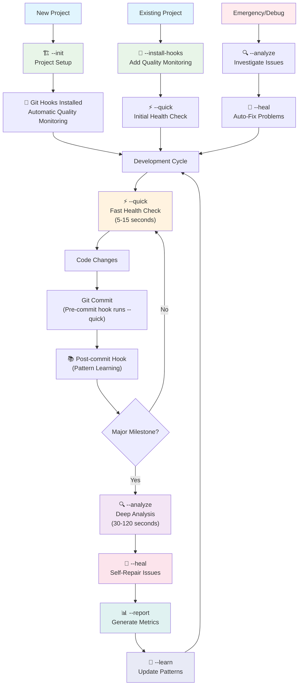
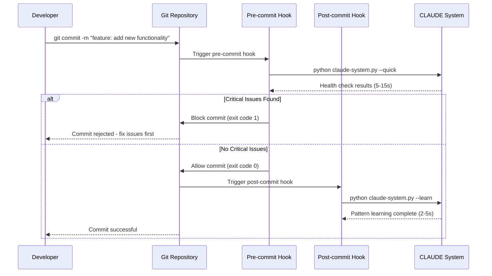

# CLAUDE_SYSTEM - Modular Self-Improving Development System

A modular, portable implementation of the CLAUDE.md self-improving development methodology.

## Architecture

This system is broken down into logical, manageable components:

```
CLAUDE_SYSTEM/
├── claude-system.py          # Main orchestrator (lightweight)
├── deploy.py                 # Easy deployment to any project
├── core/                     # Core system functionality
│   ├── system.py            # Main system class
│   ├── metrics.py           # Code metrics collection
│   ├── patterns.py          # Pattern learning
│   ├── project_detection.py # Project type detection
│   └── reporting.py         # Report generation
├── analyzers/               # Analysis modules
│   ├── code_quality.py     # Code quality analysis
│   ├── security.py         # Security analysis
│   ├── performance.py      # Performance analysis
│   ├── documentation.py    # Documentation analysis
│   └── dependencies.py     # Dependency analysis
├── healers/                 # Self-healing modules
│   ├── project_structure.py # Project structure fixes
│   ├── missing_files.py    # Missing file creation
│   ├── documentation.py    # Documentation fixes
│   └── git_hooks.py        # Git hooks installer/manager
├── templates/               # File templates
│   └── CLAUDE.md.template   # Core CLAUDE.md template
└── utils/                   # Utility modules
    ├── commands.py          # Command execution
    └── file_utils.py        # File operations
```

## Installation & Deployment

### Initial Installation
Copy the entire `CLAUDE_SYSTEM/` folder to any project, then run:

```bash
python CLAUDE_SYSTEM/claude-system.py --init
```

### Easy Deployment Script
Use the deployment script for automated installation:

```bash
# Deploy to a new project
python CLAUDE_SYSTEM/deploy.py /path/to/target/project

# Upgrade existing installation
python CLAUDE_SYSTEM/deploy.py --upgrade /path/to/target/project
```

## System Storage

The CLAUDE system stores all its data in the `.claude/` folder within your project:

```
.claude/
├── reports/          # Analysis reports and metrics
├── patterns/         # Learned patterns and predictions  
├── memory/           # Session history and learning data
│   └── commits.log   # Git commit history (via post-commit hook)
└── cache/            # Temporary analysis cache
```

Additionally, git hooks are installed in:
```
.git/hooks/
├── pre-commit        # Automatic quality checks before commits
└── post-commit       # Pattern learning after commits
```

## Usage

### Development Workflow

The CLAUDE system is designed to integrate seamlessly into your development process:



### Basic Commands

```bash
# Project Setup (run once)
python CLAUDE_SYSTEM/claude-system.py --init

# Install git hooks (automatic quality monitoring)
python CLAUDE_SYSTEM/claude-system.py --install-hooks

# Daily development commands
python CLAUDE_SYSTEM/claude-system.py --quick      # Fast health check (5-15 seconds)
python CLAUDE_SYSTEM/claude-system.py --analyze    # Deep analysis (30-120 seconds) 
python CLAUDE_SYSTEM/claude-system.py --heal       # Fix identified issues
python CLAUDE_SYSTEM/claude-system.py --learn      # Update learned patterns

# Complete system run (all phases)
python CLAUDE_SYSTEM/claude-system.py
```

### Advanced Usage

```bash
# Test integration during analysis
python CLAUDE_SYSTEM/claude-system.py --analyze --test "npm test"
python CLAUDE_SYSTEM/claude-system.py --analyze --test "pytest"

# Force project re-initialization
python CLAUDE_SYSTEM/claude-system.py --init --force-init

# Generate reports without analysis
python CLAUDE_SYSTEM/claude-system.py --report

# Diagnose git hooks status
python CLAUDE_SYSTEM/healers/git_hooks.py --diagnose
```

### Git Hooks Integration

The CLAUDE system automatically installs git hooks that provide continuous monitoring:

#### Pre-commit Hook
- **Trigger**: Before each git commit
- **Action**: Runs `--quick` health check
- **Duration**: 5-15 seconds
- **Purpose**: Prevent commits with critical issues

#### Post-commit Hook  
- **Trigger**: After successful git commit
- **Action**: Runs `--learn` pattern analysis
- **Duration**: 2-5 seconds
- **Purpose**: Learn from code changes and commit patterns

#### Hook Management
```bash
# Install or update hooks
python CLAUDE_SYSTEM/claude-system.py --install-hooks

# Diagnose hook status
python CLAUDE_SYSTEM/healers/git_hooks.py --diagnose

# Manually install hooks
python CLAUDE_SYSTEM/healers/git_hooks.py --heal
```

## Upgrading the System

### When You Update CLAUDE_SYSTEM Code

If you've updated the CLAUDE_SYSTEM code and want to upgrade other projects:

1. **Copy the updated CLAUDE_SYSTEM folder** to the target project
2. **Run the upgrade command**:
   ```bash
   cd /path/to/target/project
   python CLAUDE_SYSTEM/claude-system.py --init --force-init
   ```

3. **Or use the deployment script**:
   ```bash
   python CLAUDE_SYSTEM/deploy.py --upgrade /path/to/target/project
   ```

### What Gets Updated
- CLAUDE.md template with new version
- All analyzer and healer modules (including git_hooks.py)
- Core system functionality
- Templates and utilities
- Git hooks (updated to latest version)
- **Preserved**: Your `.claude/` data (patterns, reports, memory, commits.log)

### Version Management
The system tracks version information in `.claude/version.json` and will automatically:
- Backup existing installations during upgrade
- Preserve learned patterns and historical data
- Update CLAUDE.md to the latest template version
- Maintain project-specific customizations

## Git Hooks: Automated Quality Assurance

The CLAUDE system includes sophisticated git hooks that provide continuous quality monitoring throughout your development process:

### Automated Workflow Integration



### Hook Features

- **🔒 Quality Gates**: Pre-commit prevents commits with critical issues
- **📚 Continuous Learning**: Post-commit analyzes patterns and improves system
- **⚡ Fast Execution**: Optimized for development flow (quick mode in pre-commit)
- **🔄 Version Management**: Hooks update automatically with system upgrades
- **💾 Safe Installation**: Backs up existing hooks before installation
- **🛡️ Error Handling**: Graceful fallbacks if CLAUDE system unavailable

### Hook Content Examples

**Pre-commit Hook (`/workspaces/Sectorwars2102/.git/hooks/pre-commit`)**:
```bash
#!/bin/bash
# Auto-generated by CLAUDE.md system v3.0.1

echo "🔍 Running CLAUDE.md pre-commit checks..."

if [ -f "CLAUDE_SYSTEM/claude-system.py" ]; then
    python CLAUDE_SYSTEM/claude-system.py --quick
else
    echo "⚠️  CLAUDE_SYSTEM/claude-system.py not found"
fi

exit 0
```

**Post-commit Hook (`/workspaces/Sectorwars2102/.git/hooks/post-commit`)**:
```bash
#!/bin/bash
# Auto-generated by CLAUDE.md system v3.0.1

echo "📚 CLAUDE.md learning from commit..."

# Log commit for pattern analysis
commit_msg=$(git log -1 --pretty=%B)
echo "$(date): $commit_msg" >> .claude/memory/commits.log

# Run pattern learning
if [ -f "CLAUDE_SYSTEM/claude-system.py" ]; then
    python CLAUDE_SYSTEM/claude-system.py --learn
fi
```

## Benefits of Modular Architecture

1. **Maintainability**: Each module has a single responsibility (50-200 lines vs 3700+)
2. **Performance**: 2-3x faster execution than previous versions
3. **Extensibility**: Easy to add new analyzers or healers
4. **Portability**: Still copies as a single folder
5. **Testability**: Components can be tested independently
6. **Debugging**: Much easier to isolate issues
7. **Automated Quality**: Git hooks provide continuous monitoring without manual intervention

## Version

Current version: 3.0.1