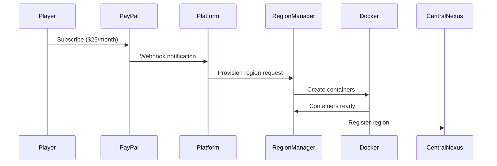

# SectorWars 2102 - Multi-Regional Docker Architecture

This document describes the comprehensive Docker architecture for the SectorWars 2102 multi-regional platform, enabling dynamic scaling from a single galaxy to hundreds of player-owned regions.

## Architecture Overview

### Core Components

1. **Central Nexus** - The galactic hub (2000-5000 sectors)
2. **Regional Servers** - Player-owned regions (500 sectors each)
3. **Region Manager** - Dynamic container provisioning service
4. **Load Balancer** - Nginx gateway for traffic routing
5. **Monitoring Stack** - Prometheus + Grafana for observability

### Network Architecture

```
Internet → Nginx Gateway → Central Nexus / Regional Servers
                      ↓
                 Region Manager → Docker Host
                      ↓
              Dynamic Regional Containers
```

## Quick Start

### Prerequisites

- Docker 20.10+ with Docker Compose
- 64 vCPU / 64GB RAM server (recommended)
- 500GB+ available disk space
- Linux host OS (Ubuntu 20.04+ recommended)

### Setup

1. **Clone and Setup**
   ```bash
   git clone <repository>
   cd Sectorwars2102
   chmod +x scripts/setup-multi-regional.sh
   ./scripts/setup-multi-regional.sh
   ```

2. **Configure PayPal Credentials**
   ```bash
   nano .env.multi-regional
   # Add your PayPal credentials
   ```

3. **Start Platform**
   ```bash
   docker-compose -f docker-compose.multi-regional.yml up -d
   ```

## Service Architecture

### Central Nexus Services

| Service | Port | Description |
|---------|------|-------------|
| `central-nexus-server` | 8080 | Main game API and hub |
| `central-nexus-db` | 5433 | PostgreSQL database |
| `redis-nexus` | 6379 | Cross-regional communication |
| `admin-ui` | 3001 | Administrative interface |
| `player-client` | 3000 | Player web interface |
| `nginx-gateway` | 80/443 | Load balancer and SSL termination |

### Dynamic Regional Services

Each region gets its own isolated stack:

| Service | Description |
|---------|-------------|
| `region-{name}-server` | Regional game server |
| `region-{name}-db` | Isolated PostgreSQL database |
| `region-{name}-cache` | Regional Redis cache |
| `region-{name}-worker` | Background task processor |
| `region-{name}-storage` | Persistent file storage |

### Management Services

| Service | Port | Description |
|---------|------|-------------|
| `region-manager` | 8081 | Container orchestration |
| `prometheus` | 9090 | Metrics collection |
| `grafana` | 3002 | Monitoring dashboards |

## Regional Provisioning Process

### 1. Subscription Creation


### 2. Container Lifecycle

**Provisioning:**
1. Validate subscription status
2. Create isolated database
3. Generate region configuration
4. Deploy container stack from template
5. Register with Central Nexus
6. Configure inter-regional routing

**Scaling:**
- CPU/Memory: Docker resource limits
- Auto-scaling: Based on player count and resource usage
- Manual scaling: Via CLI or admin interface

**Termination:**
1. Graceful player evacuation (30-day notice)
2. Data backup and export
3. Container cleanup
4. Database removal
5. Network cleanup

## Resource Management

### Default Allocation per Region

| Resource | Default | Min | Max |
|----------|---------|-----|-----|
| CPU Cores | 2.0 | 1.0 | 8.0 |
| Memory | 4GB | 2GB | 16GB |
| Storage | 20GB | 10GB | 100GB |
| Players | 100 | 10 | 1000 |

### Auto-Scaling Triggers

- **Scale Up:** CPU > 80% OR Memory > 85%
- **Scale Down:** CPU < 20% AND Memory < 30% (sustained)
- **Cooldown:** 5 minutes between scaling actions

## Networking

### Network Isolation

- **Nexus Network** (`172.20.0.0/16`): Central services
- **Regional Network** (`172.21.0.0/16`): Cross-regional communication
- **Region-Specific** (`172.22.x.0/24`): Isolated per region

### Traffic Routing

```nginx
# Central Nexus API
/api/v1/* → central-nexus-server:8080

# Regional API (dynamic routing)
/api/v1/regions/{name}/* → region-{name}-server:8080

# WebSocket support
/ws/* → appropriate server with upgrade headers
```

## Security

### Container Isolation

- Each region runs in isolated containers
- Network segmentation prevents cross-region access
- Resource limits prevent resource exhaustion
- Security scanning of all base images

### Access Control

- JWT-based authentication
- Regional permission system
- Role-based access control (RBAC)
- API rate limiting per region

### Data Protection

- Encrypted connections (TLS 1.3)
- Database-level encryption at rest
- Regular automated backups
- GDPR compliance for user data

## Monitoring & Observability

### Metrics Collection

**Platform Metrics:**
- Total regions and players
- Resource utilization
- Revenue tracking
- Performance benchmarks

**Regional Metrics:**
- Player activity
- Transaction volume
- Response times
- Error rates

### Alerting

**Critical Alerts:**
- Regional server down
- Central Nexus unavailable
- Database connection failures
- Resource exhaustion

**Business Alerts:**
- Low player activity
- Subscription failures
- High resource usage
- Unusual transaction patterns

## Development & Operations

### CLI Management

```bash
# List regions
./scripts/region-cli.py list

# Show region details
./scripts/region-cli.py show my-region

# Scale region resources
./scripts/region-cli.py scale my-region --cpu 4 --memory 8 --disk 40

# Generate region config
./scripts/region-cli.py config sample-region.yml
```

### API Management

```bash
# Health check
curl http://localhost/api/v1/status/health

# Region metrics
curl http://localhost/api/v1/region-manager/metrics

# Provision new region
curl -X POST http://localhost/api/v1/region-manager/regions/provision \
  -H "Content-Type: application/json" \
  -d @region-config.json
```

### Log Management

```bash
# View Central Nexus logs
docker-compose logs -f central-nexus-server

# View region logs
docker-compose logs -f region-myregion-server

# View all regional logs
docker-compose logs -f | grep "region-.*-server"
```

## Backup & Recovery

### Automated Backups

- **Central Nexus:** Daily full backup + hourly incremental
- **Regional Data:** Daily backup per region
- **Configuration:** Git-based version control
- **Retention:** 30 days online, 1 year archived

### Disaster Recovery

1. **Data Loss:** Restore from latest backup
2. **Container Failure:** Auto-restart with health checks
3. **Host Failure:** Migration to backup host
4. **Region Corruption:** Rollback to last known good state

## Performance Optimization

### Database Optimization

- Connection pooling per service
- Read replicas for heavy queries
- Automatic index management
- Query performance monitoring

### Caching Strategy

- Redis for session data
- Regional caching for game state
- CDN for static assets
- API response caching

### Resource Optimization

- Container image optimization
- Lazy loading of regional services
- Resource request/limit tuning
- Network compression

## Cost Management

### Resource Costs

- Base platform: ~$200/month (64 vCPU server)
- Per region: ~$5-15/month (depending on usage)
- Revenue: $25/month per region + $5/month galactic citizens
- Break-even: ~15 active regions

### Optimization Strategies

- Auto-scaling to optimize resource usage
- Spot instances for development/testing
- Reserved instances for stable workloads
- Resource usage monitoring and reporting

## Troubleshooting

### Common Issues

**Container Won't Start:**
```bash
# Check logs
docker-compose logs region-{name}-server

# Check resource limits
docker stats

# Verify network connectivity
docker network ls
```

**Database Connection Issues:**
```bash
# Test database connectivity
docker-compose exec central-nexus-db psql -U nexus_admin -d central_nexus

# Check database logs
docker-compose logs central-nexus-db
```

**Performance Issues:**
```bash
# Check resource usage
docker stats

# Monitor metrics
curl http://localhost:9090/metrics

# View Grafana dashboards
open http://localhost:3002
```

## Future Enhancements

### Planned Features

1. **Multi-Cloud Support:** Deploy across AWS, GCP, Azure
2. **Edge Regions:** Geographically distributed regions
3. **Advanced Auto-Scaling:** ML-based resource prediction
4. **Federation Clustering:** Multi-host region deployment
5. **Real-time Migration:** Live region migration between hosts

### Scalability Roadmap

- **Phase 1:** 50 regions (current architecture)
- **Phase 2:** 200 regions (multi-host clustering)
- **Phase 3:** 1000+ regions (cloud-native architecture)
- **Phase 4:** Global distribution (edge computing)

## Support & Documentation

### Getting Help

- **Issues:** GitHub Issues for bug reports
- **Documentation:** `/docs` directory
- **Community:** Discord server for discussions
- **Enterprise:** Professional support available

### Contributing

1. Fork the repository
2. Create feature branch
3. Submit pull request
4. Follow coding standards
5. Include tests and documentation