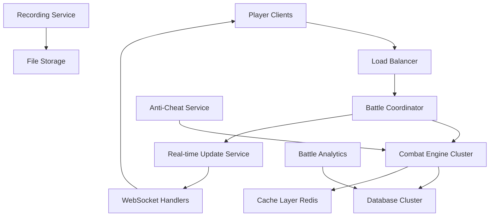

# Large-Scale Combat System Architecture
**Version**: 1.0  
**Author**: Claude + Max Collaborative Design  
**Target**: 100v100+ unit battles with real-time performance  
**Scope**: Multi-perspective enterprise architecture  

---

## 🎯 Executive Summary

The Large-Scale Combat System enables epic space battles with hundreds of units while maintaining enterprise-grade performance, security, and economic viability across our multi-regional platform.

### Key Capabilities
- **100v100+ drone/ship battles** with <3 second turn resolution
- **Real-time visual feedback** for all participants and spectators
- **Economically sustainable** for instance owners
- **Cheat-proof architecture** with server-side validation
- **Scalable to 1000+ concurrent battles** across regions

---

## 👑 UNIVERSE OWNER PERSPECTIVE (Max)

### **Strategic Vision**
```typescript
interface UniverseOwnerGoals {
  monopolization: "Prevent any single player/alliance from dominating";
  engagement: "Create epic moments that drive player retention";
  monetization: "Combat drives demand for premium ships/drones";
  scalability: "System works across 1000+ regional instances";
  storytelling: "Battles become legendary stories in game lore";
}
```

### **Revenue Model Integration**
```markdown
## Combat-Driven Economy

### Direct Revenue
- **Premium Ship Classes**: Superior combat performance ($5-50/ship)
- **Advanced Drone Types**: Specialized combat roles ($1-5/drone) 
- **Battle Passes**: Seasonal combat achievements ($10/season)
- **Epic Battle Recordings**: Players pay to save/share battles ($1/battle)

### Indirect Revenue  
- **Territory Value**: Combat drives demand for strategic sectors
- **Resource Scarcity**: Wars deplete resources, driving trade
- **Insurance Markets**: Players buy protection against losses
- **Mercenary Services**: Professional combat guilds create economy

### Instance Owner Revenue Share
- 70% to instance owners for hosting combat infrastructure
- 20% to universe owner (platform fee)
- 10% reserved for prize pools and tournaments
```

### **Lore & Narrative Integration**
```markdown
## Epic Battle Documentation System

### Automatic Battle Chronicles
- Every 100+ unit battle becomes historical record
- AI generates battle summaries with dramatic flair
- Player actions become part of sector/regional lore
- Famous commanders get permanent recognition

### Example Generated Lore:
"The Battle of Nexus-7 raged for three hours as Admiral [PlayerName]'s 
drone swarm of 150 units clashed with the defending forces of the 
Mining Consortium. When the quantum mines detonated, the resulting 
explosion was visible from twelve sectors away..."
```

---

## 🏢 INSTANCE OWNER PERSPECTIVE

### **Infrastructure Requirements**
```yaml
# Hardware Specifications for Large Combat
minimum_specs:
  cpu: "8 cores, 3.2GHz+"
  ram: "32GB"
  storage: "1TB NVMe SSD"
  network: "1Gbps symmetrical"
  database: "PostgreSQL with Redis cache"

recommended_specs:
  cpu: "16 cores, 3.8GHz+"
  ram: "64GB" 
  storage: "2TB NVMe SSD"
  network: "10Gbps symmetrical"
  database: "PostgreSQL cluster + Redis cluster"

battle_performance:
  100v100_battle: "3-5 seconds per turn"
  500v500_battle: "8-12 seconds per turn"
  concurrent_battles: "20+ simultaneous"
```

### **Economic Viability**
```typescript
interface InstanceOwnerEconomics {
  // Monthly costs
  infrastructure: "$200-800/month";
  bandwidth: "$100-300/month";
  support: "$100-200/month";
  
  // Revenue potential
  premium_subscriptions: "$2000-8000/month"; // 200-800 paying users
  battle_fees: "$500-2000/month"; // Transaction fees
  special_events: "$1000-5000/month"; // Tournaments, campaigns
  
  // Net profit projection
  monthly_profit: "$2200-14000/month";
  roi_timeframe: "3-6 months";
}
```

### **Management Interface**
```markdown
## Instance Owner Combat Dashboard

### Real-time Monitoring
- Current battle count and performance metrics
- Resource usage (CPU, RAM, bandwidth) per battle
- Revenue from combat-related activities
- Player satisfaction scores

### Configuration Controls
- Maximum battle size limits (balance performance vs features)
- Combat fees and revenue sharing
- Emergency battle termination (anti-griefing)
- Battle recording and archival settings

### Financial Analytics
- Combat-driven revenue breakdown
- Infrastructure cost optimization
- Player spending patterns on combat features
- Competitive analysis vs other instances
```

---

## 🎮 PLAYER PERSPECTIVE

### **Combat Experience Tiers**

#### **🥉 Bronze Tier (Free Players)**
```markdown
### What You Can Do
- Participate in battles up to 50v50
- Command up to 25 units personally
- Access basic ship/drone types
- Join alliance battles as junior commander

### Limitations
- 3-second delay before seeing battle results
- Cannot initiate battles >25v25
- Basic visual effects only
- Limited battle recording (last 5 battles)
```

#### **🥈 Silver Tier ($5/month)**
```markdown
### Enhanced Experience
- Participate in battles up to 100v100
- Command up to 50 units personally
- Access to advanced drone types
- Real-time battle feed (1-second updates)
- Enhanced visual effects and camera angles
- Battle recording (unlimited)
- Post-battle analytics and replays
```

#### **🥇 Gold Tier ($15/month)**
```markdown
### Premium Commander Experience
- Participate in battles up to 500v500
- Command up to 100 units personally
- Access to all ship/drone types
- Real-time battle feed (instant updates)
- Premium visual effects and cinematic cameras
- AI tactical advisor suggestions
- Historical battle database access
- Custom battle arena creation
```

### **Player Battle Interface**
```markdown
## Combat Command Center

### Pre-Battle Planning (2-5 minutes)
┌─────────────────────────────────────────┐
│ DEPLOYMENT PHASE - Sector Delta-7       │
├─────────────────┬───────────────────────┤
│ YOUR FORCES     │ BATTLE PREVIEW        │
│ ⚔️ 85 Drones    │     [M] 🔴🔴🔴🔴    │
│ 🚀 12 Ships     │   [M] 🔴🔴🔴🔴🔴     │
│ ⛽ Fuel: 85%    │ 🟦🟦🟦🟦 vs 🔴🔴🔴  │
│                 │   [M] 🟦🟦🟦🟦       │
├─────────────────┼───────────────────────┤
│ TACTICS         │ OBJECTIVES            │
│ ○ Aggressive    │ ☑ Capture Sector     │
│ ● Balanced      │ ☐ Minimize Losses    │
│ ○ Defensive     │ ☐ Destroy Defenses   │
├─────────────────┴───────────────────────┤
│ [DEPLOY] [RETREAT] [REQUEST BACKUP]     │
└─────────────────────────────────────────┘
```

### **During Battle Experience**
```markdown
## Real-Time Battle HUD

### Gold Tier Experience
- Smooth 60fps 3D visualization
- Individual unit selection and orders
- Tactical pause (10 seconds, once per battle)
- AI advisor: "Recommend flanking maneuver on east side"
- Live damage calculations with predictive modeling

### Silver Tier Experience  
- 30fps 3D visualization
- Formation-level orders
- Battle statistics overlay
- Simplified tactical suggestions

### Bronze Tier Experience
- 2D tactical view with unit icons
- Basic statistics
- Turn-by-turn text updates
```

---

## 🏗️ TECHNICAL ARCHITECTURE

### **System Overview**


### **Combat Engine Architecture**
```typescript
interface CombatEngineCluster {
  // Horizontal scaling
  battle_nodes: {
    count: number; // Auto-scale based on demand
    capacity: "10 concurrent battles per node";
    failover: "Hot standby with <5 second switchover";
  };
  
  // Battle processing pipeline
  pipeline: {
    input_validation: "Anti-cheat + command parsing";
    combat_calculation: "Parallel damage computation";
    state_update: "Atomic database transactions";
    result_broadcast: "WebSocket to all participants";
  };
  
  // Performance optimization
  optimization: {
    batch_processing: "Group similar operations";
    predictive_caching: "Pre-calculate likely outcomes";
    lazy_loading: "Load unit details on-demand";
    compression: "Efficient state representation";
  };
}
```

### **Real-time Update Architecture**
```typescript
interface RealTimeUpdates {
  // Update frequency based on subscription tier
  update_rates: {
    gold: "Instant (0ms delay)";
    silver: "1 second batched updates";
    bronze: "3 second batched updates";
    spectator: "5 second summary updates";
  };
  
  // Data optimization
  data_layers: {
    critical: "Unit health, positions, combat results";
    important: "Formations, orders, special abilities";
    cosmetic: "Visual effects, detailed animations";
  };
  
  // Bandwidth management
  compression: {
    delta_updates: "Only send changes since last update";
    spatial_culling: "Only units visible to player";
    level_of_detail: "Reduce precision for distant units";
  };
}
```

---

## 🛡️ SECURITY & ANTI-CHEAT

### **Server-Side Validation**
```typescript
interface AntiCheatSystem {
  command_validation: {
    rate_limiting: "Max 10 commands per second per player";
    range_checking: "Units can only act within movement range";
    resource_validation: "Sufficient fuel/ammo for actions";
    timing_validation: "Commands within allowed time window";
  };
  
  battle_integrity: {
    deterministic_rng: "Server-controlled random seed";
    state_checksums: "Validate battle state consistency";
    audit_logging: "Record all commands for investigation";
    rollback_capability: "Revert to last valid state";
  };
  
  economic_protection: {
    unit_verification: "Confirm ownership of all units";
    cost_validation: "Player has resources for actions";
    loss_tracking: "Accurate unit destruction recording";
    insurance_claims: "Automated loss compensation";
  };
}
```

### **Cheat Detection**
```typescript
interface CheatDetection {
  behavioral_analysis: {
    impossible_actions: "Movements faster than max speed";
    perfect_prediction: "Suspiciously optimal decisions";
    statistical_anomalies: "Win rates outside normal range";
    coordination_patterns: "Multi-account coordination";
  };
  
  technical_monitoring: {
    client_modification: "Detect modified game files";
    network_anomalies: "Unusual packet patterns";
    timing_analysis: "Inhuman reaction speeds";
    resource_spoofing: "Claimed vs actual resources";
  };
  
  investigation_tools: {
    battle_replay: "Step-by-step action review";
    statistical_dashboard: "Player performance analysis";
    community_reporting: "Player-initiated investigations";
    automated_banning: "Confidence-based account actions";
  };
}
```

---

## 📊 PERFORMANCE OPTIMIZATION

### **Database Optimization**
```sql
-- Optimized battle state storage
CREATE TABLE battle_states (
    battle_id UUID PRIMARY KEY,
    turn_number INTEGER,
    compressed_state BYTEA, -- Compressed JSON
    state_hash CHAR(64), -- Integrity verification
    created_at TIMESTAMP DEFAULT NOW()
);

-- Partitioned by battle completion
CREATE INDEX idx_battles_active ON battle_states (battle_id) 
WHERE turn_number = (SELECT MAX(turn_number) FROM battle_states bs WHERE bs.battle_id = battle_states.battle_id);

-- High-speed unit lookup
CREATE INDEX idx_units_battle_position ON units (battle_id, x_position, y_position) 
WHERE status = 'active';
```

### **Caching Strategy**
```typescript
interface CacheStrategy {
  // Redis cache layers
  battle_state: {
    ttl: "30 seconds";
    key_pattern: "battle:{battle_id}:state";
    eviction: "LRU with 10GB memory limit";
  };
  
  unit_templates: {
    ttl: "1 hour";
    key_pattern: "unit_template:{type}:{level}";
    preload: "All common unit types at startup";
  };
  
  combat_calculations: {
    ttl: "5 minutes";
    key_pattern: "combat:{attacker_type}:{defender_type}:{conditions_hash}";
    purpose: "Cache common damage calculations";
  };
  
  // Cache warming
  predictive_caching: {
    next_turn_state: "Pre-calculate likely outcomes";
    adjacent_sectors: "Cache nearby battle information";
    player_preferences: "Cache common formation templates";
  };
}
```

### **Algorithm Optimization**
```typescript
interface OptimizedCombatAlgorithms {
  // Parallel damage calculation
  parallel_processing: {
    thread_pool: "One thread per 25 units";
    batch_size: "Optimal batch of 10-15 combat pairs";
    result_aggregation: "Lock-free result collection";
  };
  
  // Spatial optimization
  spatial_indexing: {
    quadtree: "Divide battlefield into regions";
    range_queries: "Fast proximity detection";
    collision_detection: "Efficient overlap checking";
  };
  
  // AI optimization
  ai_shortcuts: {
    decision_caching: "Cache AI decisions for similar situations";
    behavior_templates: "Pre-computed behavior patterns";
    priority_queuing: "Process high-value units first";
  };
}
```

---

## 💰 ECONOMIC BALANCE

### **Unit Economics**
```typescript
interface UnitEconomics {
  // Cost scaling
  drone_costs: {
    basic_attack: "100 credits";
    advanced_defense: "500 credits";
    elite_specialist: "2000 credits";
    maintenance_per_day: "1% of purchase price";
  };
  
  ship_costs: {
    corvette: "50,000 credits";
    destroyer: "200,000 credits";
    battleship: "1,000,000 credits";
    carrier: "2,500,000 credits";
  };
  
  // Battle economics
  engagement_costs: {
    fuel_consumption: "10 credits per sector moved";
    ammunition_cost: "5-50 credits per shot fired";
    repair_costs: "25% of damage taken";
    insurance_premiums: "2% of fleet value per battle";
  };
  
  // Victory rewards
  battle_rewards: {
    sector_capture: "10,000-100,000 credits (based on value)";
    ship_salvage: "10-25% of destroyed ship value";
    reputation_bonus: "Improved trading terms";
    territory_income: "Ongoing revenue from controlled sectors";
  };
}
```

### **Economic Balancing Mechanisms**
```typescript
interface EconomicBalance {
  // Prevent runaway wealth
  wealth_caps: {
    fleet_size_limits: "Based on player level/reputation";
    concurrent_battles: "Limit simultaneous engagements";
    resource_decay: "Ships require maintenance";
  };
  
  // Encourage engagement
  incentive_systems: {
    defender_bonuses: "Extra rewards for successful defense";
    underdog_multipliers: "Higher rewards for smaller fleet victories";
    participation_rewards: "Benefits for joining alliance battles";
  };
  
  // Market stability
  stabilization: {
    npc_market_makers: "Provide liquidity for ship/drone sales";
    insurance_pools: "Shared risk distribution";
    emergency_interventions: "Prevent economic crashes";
  };
}
```

---

## 🚀 SCALABILITY ARCHITECTURE

### **Horizontal Scaling**
```typescript
interface ScalabilityPlan {
  // Auto-scaling triggers
  scaling_metrics: {
    concurrent_battles: "Scale up at >80% capacity";
    response_time: "Scale up if >3 second response";
    queue_length: "Scale up if >50 battles queued";
    player_complaints: "Scale up if satisfaction <85%";
  };
  
  // Scaling implementation
  infrastructure: {
    kubernetes_deployment: "Auto-scale battle nodes";
    database_sharding: "Partition by region/sector";
    cdn_integration: "Global battle replay distribution";
    load_balancing: "Intelligent battle-to-node assignment";
  };
  
  // Performance targets
  targets: {
    small_battles: "<1 second (1-25 units per side)";
    medium_battles: "<3 seconds (26-100 units per side)";
    large_battles: "<8 seconds (101-500 units per side)";
    epic_battles: "<15 seconds (501+ units per side)";
  };
}
```

### **Global Distribution**
```typescript
interface GlobalArchitecture {
  // Regional optimization
  regional_nodes: {
    north_america: "Primary combat processing";
    europe: "Secondary processing + failover";
    asia_pacific: "Tertiary processing + edge caching";
    latency_targets: "<100ms to nearest node";
  };
  
  // Cross-region battles
  cross_region_combat: {
    coordination_node: "Central battle coordination";
    data_synchronization: "Real-time state replication";
    conflict_resolution: "Authoritative state management";
  };
  
  // Disaster recovery
  disaster_recovery: {
    backup_frequency: "Every 30 seconds during battles";
    recovery_time: "<5 minutes to restore battle state";
    data_loss_tolerance: "<1 battle turn of data";
  };
}
```

---

## 🎨 USER EXPERIENCE DESIGN

### **Battle Visualization Tiers**

#### **Spectator Mode (Free)**
```markdown
## Minimal Resource Usage
- 2D tactical view with unit icons
- 15-second delayed updates
- Text-based battle log
- Basic statistics overlay
- Limited camera angles

## Purpose
- Allow free players to watch epic battles
- Create "stadium effect" for large battles
- Encourage upgrades to premium tiers
```

#### **Participant Mode (Premium)**
```markdown
## Enhanced Engagement
- 3D battlefield visualization
- Real-time unit animations
- Cinematic camera angles
- Detailed damage indicators
- Formation management tools
- Tactical prediction overlay

## Customization
- Personal UI layouts
- Saved camera presets
- Custom unit markers
- Battle recording preferences
```

### **Mobile Optimization**
```typescript
interface MobileExperience {
  // Simplified controls
  touch_interface: {
    tap_to_select: "Unit/formation selection";
    drag_to_move: "Movement commands";
    pinch_to_zoom: "Camera control";
    swipe_for_camera: "View angle adjustment";
  };
  
  // Performance adaptation
  mobile_optimizations: {
    reduced_particle_effects: "Maintain 30fps minimum";
    simplified_models: "Lower polygon count";
    compressed_textures: "Reduce bandwidth usage";
    battery_optimization: "Adaptive frame rate";
  };
  
  // Feature parity
  core_features: {
    battle_participation: "Full combat capability";
    real_time_updates: "Same as desktop (tier-dependent)";
    voice_commands: "Optional hands-free control";
    notification_system: "Battle alerts and results";
  };
}
```

---

## 📈 METRICS & ANALYTICS

### **Battle Success Metrics**
```typescript
interface BattleMetrics {
  // Performance metrics
  technical_kpis: {
    average_turn_time: "Target: <3 seconds for 100v100";
    uptime_percentage: "Target: >99.5%";
    player_satisfaction: "Target: >90% positive ratings";
    cheat_detection_rate: "Target: <0.1% false positives";
  };
  
  // Engagement metrics
  player_kpis: {
    battles_per_player_per_week: "Target: 5+";
    average_battle_size: "Target: 50+ units per side";
    premium_conversion_rate: "Target: 15% of participants";
    battle_completion_rate: "Target: >95%";
  };
  
  // Economic metrics
  business_kpis: {
    revenue_per_battle: "Target: $2-5 per large battle";
    unit_sales_growth: "Target: 20% month-over-month";
    instance_owner_satisfaction: "Target: >85%";
    profit_margin: "Target: >60% for instance owners";
  };
}
```

### **Predictive Analytics**
```typescript
interface PredictiveAnalytics {
  // Battle outcome prediction
  outcome_modeling: {
    win_probability: "Real-time calculation during battle";
    casualty_estimation: "Help players make tactical decisions";
    economic_impact: "Show potential costs/rewards";
  };
  
  // Player behavior analysis
  behavior_prediction: {
    engagement_risk: "Identify players likely to quit";
    spending_propensity: "Target premium upgrade offers";
    social_influence: "Track alliance formation patterns";
  };
  
  // Market analysis
  economic_forecasting: {
    unit_demand_prediction: "Anticipate ship/drone market trends";
    sector_value_modeling: "Predict territory importance changes";
    resource_price_forecasting: "Help players with economic decisions";
  };
}
```

---

## 🛠️ IMPLEMENTATION ROADMAP

### **Phase 1: Foundation (Weeks 1-4)**
```markdown
## Core Combat Engine
- [ ] Parallel processing battle calculations
- [ ] Basic 100v100 support with acceptable performance
- [ ] Server-side validation and anti-cheat
- [ ] WebSocket real-time updates
- [ ] Basic battle UI for all three perspectives

## Success Criteria
- 100v100 battles complete in <8 seconds
- Zero successful cheating attempts in testing
- 95% uptime during load testing
```

### **Phase 2: Optimization (Weeks 5-8)**
```markdown
## Performance & Scaling
- [ ] Database optimization and caching
- [ ] Auto-scaling infrastructure
- [ ] Mobile client optimization
- [ ] Battle recording and replay system
- [ ] Advanced anti-cheat AI

## Success Criteria
- 100v100 battles complete in <3 seconds
- Mobile clients maintain 30fps
- Support 50+ concurrent battles per instance
```

### **Phase 3: Enhancement (Weeks 9-12)**
```markdown
## Premium Features & Polish
- [ ] Tiered subscription model implementation
- [ ] Advanced battle visualization
- [ ] AI tactical advisor
- [ ] Cross-region battle support
- [ ] Comprehensive analytics dashboard

## Success Criteria
- 15% premium conversion rate
- >90% player satisfaction scores
- Revenue targets met for instance owners
```

### **Phase 4: Epic Scale (Weeks 13-16)**
```markdown
## Massive Battle Support
- [ ] 500v500+ battle capability
- [ ] Tournament and event systems
- [ ] Battle league competitions
- [ ] Legendary battle documentation
- [ ] Cross-instance alliance wars

## Success Criteria
- 500v500 battles complete in <12 seconds
- Support for coordinated multi-instance events
- Self-sustaining competitive ecosystem
```

---

## 🎯 CONCLUSION

This Large-Scale Combat System transforms Sectorwars2102 from a trading simulation into an epic space warfare platform that serves all stakeholders:

- **Universe Owner (Max)**: Creates legendary moments and sustainable revenue
- **Instance Owners**: Profitable, manageable infrastructure with clear ROI
- **Players**: Engaging, fair, scalable combat from free to premium tiers

The architecture balances ambition with practicality, ensuring we can deliver the 100v100+ vision while maintaining enterprise-grade reliability and economic viability.

**Next Steps**: Begin Phase 1 implementation with core combat engine development, focusing on the parallel processing architecture and real-time update system.

---

*"In space, no one can hear you scream... but everyone can watch your epic 500-drone fleet clash with the enemy in glorious real-time combat."*