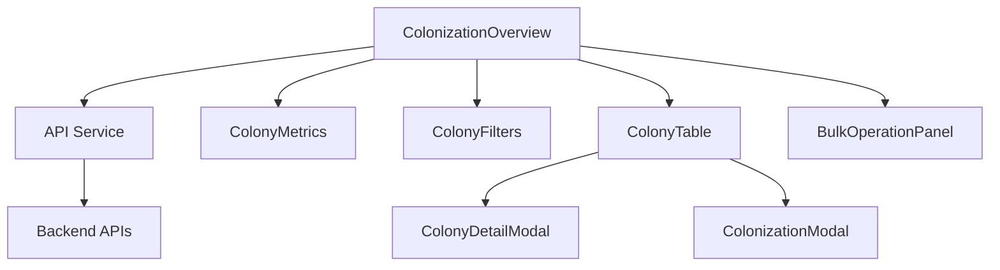

# Colonies UI Enhancement Plan
**Date:** 2025-05-25
**Feature:** Enhanced Colonies UI (ColonizationOverview)
**Phase:** 2 - Detailed Planning

## Overview
Comprehensive enhancement of the Colonies UI following the patterns established with Planet Management UI improvements. Transform the current basic interface into a modern, efficient administrative tool with professional user experience.

## Current State Analysis
- Basic statistics dashboard with planet counts
- Functional table with filtering and pagination
- Inline modals for CRUD operations (outdated pattern)
- Manual colonization workflow using prompts
- Basic CSS styling with room for improvement
- No bulk operations or advanced filtering

## Technical Design

### 1. Component Architecture Upgrade
```
ColonizationOverview (main component)
├── ColonyMetrics (enhanced statistics dashboard)
├── ColonyFilters (advanced filtering component)
├── ColonyTable (enhanced table with sorting)
├── ColonyDetailModal (dedicated modal component)
├── ColonizationModal (specialized for colony assignment)
└── BulkOperationPanel (multi-select actions)
```

### 2. New Components to Create

#### 2.1 ColonyDetailModal.tsx
- Comprehensive planet information display
- Integrated colonization controls
- Owner management with player selection
- Historical colonization data
- Environmental and resource details

#### 2.2 ColonizationModal.tsx
- Dedicated modal for colony assignment
- Player search and selection
- Colony requirements validation
- Success/failure feedback

#### 2.3 ColonyMetrics.tsx
- Enhanced statistics dashboard
- Visual indicators and progress bars
- Trend data and comparisons
- Interactive metric cards

#### 2.4 ColonyFilters.tsx
- Advanced multi-criteria filtering
- Range sliders for numeric values
- Tag-based filtering
- Saved filter presets

### 3. Data Model Enhancements
```typescript
interface EnhancedColony {
  // Existing Planet fields
  id: string;
  name: string;
  sector_id: number;
  planet_type: string;
  population: number;
  max_population: number;
  habitability_score: number;
  resource_richness: number;
  defense_level: number;
  owner_id?: string;
  owner_name?: string;
  colonized_at?: string;
  genesis_created: boolean;
  
  // Enhanced fields
  sector_name?: string;
  atmosphere?: string;
  gravity?: number;
  production_efficiency?: number;
  colony_age_days?: number;
  last_activity?: string;
}

interface ColonizationStats {
  total_planets: number;
  colonized_planets: number;
  uninhabited_planets: number;
  total_population: number;
  average_habitability: number;
  genesis_planets: number;
  // Enhanced stats
  population_growth_rate: number;
  colonization_efficiency: number;
  most_active_colonizer: string;
  newest_colony: string;
}
```

### 4. UI/UX Enhancements

#### 4.1 Modern Visual Design
- Consistent with Planet Management UI styling
- Dark space-game theme with professional touches
- Smooth animations and transitions
- Responsive grid layouts
- Visual status indicators

#### 4.2 Enhanced Interaction Patterns
- Modal-based workflows (no more inline forms)
- Drag-and-drop for bulk operations
- Quick actions on hover
- Keyboard shortcuts support
- Context menus for advanced actions

#### 4.3 Advanced Filtering System
- Multi-column sorting
- Range filters for population, habitability, resources
- Date range filtering for colonization dates
- Planet type and status filters
- Owner/player filters with autocomplete

### 5. Performance Optimizations
- Virtual scrolling for large datasets
- Debounced search and filtering
- Optimistic updates for better UX
- Efficient state management with useCallback
- Memoized components for table rows

## Implementation Tasks

### Phase 3A: Core UI Modernization (High Priority)
1. **Replace Inline Modals with ColonyDetailModal**
   - Create comprehensive detail modal component
   - Integrate colonization controls
   - Add owner assignment workflow
   - Implement proper error handling

2. **Enhance Table Design**
   - Improve visual design consistency
   - Add sorting capabilities
   - Implement bulk selection
   - Add quick action menus

3. **Modernize Statistics Dashboard**
   - Create ColonyMetrics component
   - Add visual progress indicators
   - Implement trend calculations
   - Add interactive metric cards

### Phase 3B: Advanced Features (Medium Priority)
4. **Advanced Filtering System**
   - Create ColonyFilters component
   - Implement range sliders
   - Add saved filter presets
   - Multi-criteria search

5. **Dedicated Colonization Workflow**
   - Create ColonizationModal component
   - Player search and selection
   - Validation and feedback
   - Success/failure handling

6. **Bulk Operations**
   - Multi-select functionality
   - Bulk colonization/decolonization
   - Batch property updates
   - Progress indicators

### Phase 3C: Polish & Performance (Low Priority)
7. **Performance Optimizations**
   - Virtual scrolling implementation
   - Component memoization
   - Efficient API usage
   - Loading state improvements

8. **Advanced Features**
   - Export functionality
   - Column customization
   - Keyboard shortcuts
   - Context menus

## API Integration Strategy

### Current API Usage
- ✅ GET /api/v1/admin/planets/comprehensive - Main data source
- ✅ GET /api/v1/admin/players/comprehensive - Player data
- ✅ POST /api/v1/admin/planets - Create planet
- ✅ PUT /api/v1/admin/planets/{id} - Update planet
- ✅ DELETE /api/v1/admin/planets/{id} - Delete planet

### Enhanced API Needs
- POST /api/v1/admin/planets/{id}/colonize - Assign colony
- POST /api/v1/admin/planets/{id}/decolonize - Remove colony
- GET /api/v1/admin/colonies/stats - Enhanced statistics
- POST /api/v1/admin/colonies/bulk - Bulk operations

### Data Flow Optimization


## Design System Integration

### Color Scheme
- Primary: #4a9eff (space blue)
- Success: #27ae60 (colonized)
- Warning: #f39c12 (low habitability)
- Danger: #e74c3c (uninhabitable)
- Genesis: #ff6b6b (genesis created)

### Status Indicators
- Planet Types: Color-coded backgrounds
- Habitability: Progress bars with color grades
- Population: Filled/empty indicators
- Colony Status: Badge systems
- Activity: Last activity timestamps

### Animation Patterns
- Modal slide-in animations
- Table row hover effects
- Smooth filter transitions
- Loading state animations
- Success/error feedback

## Testing Strategy

### Component Testing
- ColonyDetailModal component rendering
- ColonizationModal workflow testing
- Filter component state management
- Bulk operation validation

### Integration Testing
- Modal state synchronization
- API error handling workflows
- Filter and search performance
- Pagination and data loading

### User Experience Testing
- Colonization workflow usability
- Bulk operation efficiency
- Mobile responsiveness
- Accessibility compliance

## Risk Assessment

### Medium Risk
- **Modal State Complexity**: Managing multiple modal states simultaneously
- **Performance with Large Datasets**: Table performance with 1000+ colonies
- **API Coordination**: Ensuring backend endpoints support new features

### Mitigation Strategies
- Careful state management with proper cleanup
- Virtual scrolling and pagination optimization
- Progressive enhancement approach for new features
- Comprehensive error handling and fallbacks

## Success Criteria

### Functional Requirements
- ✅ Modern modal-based workflows
- ✅ Enhanced visual design consistency
- ✅ Advanced filtering and sorting
- ✅ Improved colonization UX
- ✅ Bulk operation capabilities

### Performance Requirements
- ⚡ Table loads < 2 seconds with 1000+ colonies
- ⚡ Filter responds < 500ms
- ⚡ Modal opens < 300ms
- ⚡ Bulk operations provide progress feedback

### User Experience Requirements
- 📱 Mobile-responsive design
- 🎯 Intuitive colonization workflow
- ⚠️ Clear error handling and feedback
- ✨ Smooth animations and transitions
- 🔍 Comprehensive search and filter capabilities

## Implementation Timeline
- **Phase 3A**: 4-5 hours (core modernization)
- **Phase 3B**: 3-4 hours (advanced features)
- **Phase 3C**: 2-3 hours (polish and performance)
- **Testing**: 2 hours
- **Documentation**: 1 hour
- **Total**: 12-15 hours

## Dependencies
- PlanetDetailModal patterns from Planet Management enhancement
- Admin UI design system components
- Enhanced backend API endpoints (if needed)
- Testing infrastructure improvements

## Success Validation
1. Visual consistency with Planet Management UI
2. Improved colonization workflow efficiency
3. Enhanced administrative capabilities
4. Professional user experience
5. Maintainable and extensible codebase