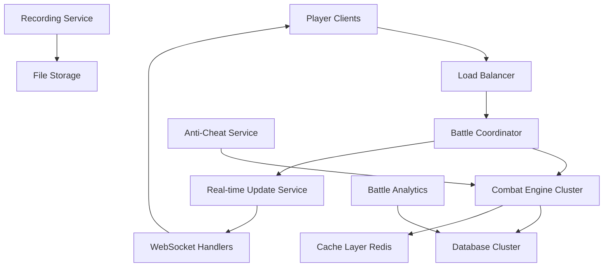

# Large-Scale & Massive Multiplayer Combat System
**Version**: 2.0 - Enterprise + Dream Big Edition
**Author**: Claude + Max Collaborative Design
**Target**: 100v100+ unit battles scaling to unlimited players
**Scope**: From tactical engagements to legendary universe-scale warfare

---

## 🎯 Executive Summary

The Large-Scale Combat System enables epic space battles from hundreds to thousands of units while maintaining enterprise-grade performance, security, and economic viability across our multi-regional platform. This system scales from tactical 100v100 battles to massive 50+ player sector-wide warfare.

### Key Capabilities
- **100v100+ drone/ship battles** with <3 second turn resolution
- **Massive 25-50+ player sector warfare** with unlimited units
- **Multi-team conflicts** (3-8 teams battling simultaneously)
- **Real-time visual feedback** for all participants and spectators
- **Economically sustainable** for instance owners
- **Cheat-proof architecture** with server-side validation
- **Scalable to 1000+ concurrent battles** across regions

---

## 🌟 THE COMBAT VISION

### **Battle Scale Classifications**
```typescript
enum BattleScale {
  SKIRMISH = "2-5 players, 10-50 units",           // Current system handles
  ENGAGEMENT = "6-15 players, 51-200 units",       // Medium battles
  CAMPAIGN = "16-30 players, 201-1000 units",      // Large battles
  MASSIVE_WAR = "31-75 players, 1001-5000 units",  // Massive battles
  LEGENDARY = "76+ players, 5000+ units",          // Legendary conflicts
}
```

### **Sector as Battlefield**
Imagine Sector Delta-7 during "The Great Mining War":
- **Team Alpha** (Mining Consortium): 8 players, 200 drones, 15 ships, defensive positions
- **Team Beta** (Pirate Alliance): 12 players, 350 drones, 25 ships, hit-and-run tactics
- **Team Gamma** (Corporate Security): 6 players, 150 drones, 20 ships, protecting assets
- **Team Delta** (Mercenary Guild): 4 players, 100 drones, 10 elite ships, hired guns
- **Independents**: 15 solo players, various small fleets, opportunistic

**Total**: 45 players, 800 drones, 70 ships, complete chaos and glory!

---

## 👑 UNIVERSE OWNER PERSPECTIVE

### **Strategic Vision**
```typescript
interface UniverseOwnerGoals {
  monopolization: "Prevent any single player/alliance from dominating";
  engagement: "Create epic moments that drive player retention";
  monetization: "Combat drives demand for premium ships/drones";
  scalability: "System works across 1000+ regional instances";
  storytelling: "Battles become legendary stories in game lore";
}
```

### **Revenue Model Integration**

#### Combat-Driven Economy

**Direct Revenue**
- **Premium Ship Classes**: Superior combat performance ($5-50/ship)
- **Advanced Drone Types**: Specialized combat roles ($1-5/drone)
- **Battle Passes**: Seasonal combat achievements ($10/season)
- **Epic Battle Recordings**: Players pay to save/share battles ($1/battle)
- **Premium Battle Access**: Required for massive battles ($15/month)

**Indirect Revenue**
- **Territory Value**: Combat drives demand for strategic sectors
- **Resource Scarcity**: Wars deplete resources, driving trade
- **Insurance Markets**: Players buy protection against losses
- **Mercenary Services**: Professional combat guilds create economy
- **Broadcasting Rights**: Monetize spectacular battles

**Instance Owner Revenue Share**
- 70% to instance owners for hosting combat infrastructure
- 20% to universe owner (platform fee)
- 10% reserved for prize pools and tournaments

### **Lore & Narrative Integration**

#### Epic Battle Documentation System

**Automatic Battle Chronicles**
- Every 100+ unit battle becomes historical record
- AI generates battle summaries with dramatic flair
- Player actions become part of sector/regional lore
- Famous commanders get permanent recognition

**Example Generated Lore:**
"The Battle of Nexus-7 raged for three hours as Admiral [PlayerName]'s
drone swarm of 150 units clashed with the defending forces of the
Mining Consortium. When the quantum mines detonated, the resulting
explosion was visible from twelve sectors away..."

---

## 🏢 INSTANCE OWNER PERSPECTIVE

### **Infrastructure Requirements**
```yaml
# Hardware Specifications for Large Combat
minimum_specs:
  cpu: "8 cores, 3.2GHz+"
  ram: "32GB"
  storage: "1TB NVMe SSD"
  network: "1Gbps symmetrical"
  database: "PostgreSQL with Redis cache"

recommended_specs:
  cpu: "16 cores, 3.8GHz+"
  ram: "64GB"
  storage: "2TB NVMe SSD"
  network: "10Gbps symmetrical"
  database: "PostgreSQL cluster + Redis cluster"

battle_performance:
  100v100_battle: "3-5 seconds per turn"
  500v500_battle: "8-12 seconds per turn"
  concurrent_battles: "20+ simultaneous"
```

### **Economic Viability**
```typescript
interface InstanceOwnerEconomics {
  // Monthly costs
  infrastructure: "$200-800/month";
  bandwidth: "$100-300/month";
  support: "$100-200/month";

  // Revenue potential
  premium_subscriptions: "$2000-8000/month"; // 200-800 paying users
  battle_fees: "$500-2000/month"; // Transaction fees
  special_events: "$1000-5000/month"; // Tournaments, campaigns

  // Net profit projection
  monthly_profit: "$2200-14000/month";
  roi_timeframe: "3-6 months";
}
```

### **Management Interface**

#### Instance Owner Combat Dashboard

**Real-time Monitoring**
- Current battle count and performance metrics
- Resource usage (CPU, RAM, bandwidth) per battle
- Revenue from combat-related activities
- Player satisfaction scores

**Configuration Controls**
- Maximum battle size limits (balance performance vs features)
- Combat fees and revenue sharing
- Emergency battle termination (anti-griefing)
- Battle recording and archival settings

**Financial Analytics**
- Combat-driven revenue breakdown
- Infrastructure cost optimization
- Player spending patterns on combat features
- Competitive analysis vs other instances

---

## 🎮 PLAYER PERSPECTIVE

### **Combat Experience Tiers**

#### **🥉 Bronze Tier (Free Players)**
**What You Can Do**
- Participate in battles up to 50v50
- Command up to 25 units personally
- Access basic ship/drone types
- Join alliance battles as junior commander

**Limitations**
- 3-second delay before seeing battle results
- Cannot initiate battles >25v25
- Basic visual effects only
- Limited battle recording (last 5 battles)

#### **🥈 Silver Tier ($5/month)**
**Enhanced Experience**
- Participate in battles up to 100v100
- Command up to 50 units personally
- Access to advanced drone types
- Real-time battle feed (1-second updates)
- Enhanced visual effects and camera angles
- Battle recording (unlimited)
- Post-battle analytics and replays

#### **🥇 Gold Tier ($15/month)**
**Premium Commander Experience**
- Participate in battles up to 500v500
- Command up to 100 units personally
- Access to all ship/drone types
- Real-time battle feed (instant updates)
- Premium visual effects and cinematic cameras
- AI tactical advisor suggestions
- Historical battle database access
- Custom battle arena creation
- **Access to massive multiplayer battles** (25+ players)

### **Player Battle Interface**

#### Pre-Battle Planning (2-5 minutes)
```
┌─────────────────────────────────────────┐
│ DEPLOYMENT PHASE - Sector Delta-7       │
├─────────────────┬───────────────────────┤
│ YOUR FORCES     │ BATTLE PREVIEW        │
│ ⚔️ 85 Drones    │     [M] 🔴🔴🔴🔴    │
│ 🚀 12 Ships     │   [M] 🔴🔴🔴🔴🔴     │
│ ⛽ Fuel: 85%    │ 🟦🟦🟦🟦 vs 🔴🔴🔴  │
│                 │   [M] 🟦🟦🟦🟦       │
├─────────────────┼───────────────────────┤
│ TACTICS         │ OBJECTIVES            │
│ ○ Aggressive    │ ☑ Capture Sector     │
│ ● Balanced      │ ☐ Minimize Losses    │
│ ○ Defensive     │ ☐ Destroy Defenses   │
├─────────────────┴───────────────────────┤
│ [DEPLOY] [RETREAT] [REQUEST BACKUP]     │
└─────────────────────────────────────────┘
```

#### During Battle Experience
**Gold Tier Experience**
- Smooth 60fps 3D visualization
- Individual unit selection and orders
- Tactical pause (10 seconds, once per battle)
- AI advisor: "Recommend flanking maneuver on east side"
- Live damage calculations with predictive modeling

**Silver Tier Experience**
- 30fps 3D visualization
- Formation-level orders
- Battle statistics overlay
- Simplified tactical suggestions

**Bronze Tier Experience**
- 2D tactical view with unit icons
- Basic statistics
- Turn-by-turn text updates

---

## 🏛️ TEAM HOME BASE SYSTEM

### **Sector Ownership Evolution**
```typescript
interface TeamHomeBase {
  primary_base: {
    sector_id: "team_headquarters";
    defense_rating: "fortress_level";
    player_capacity: "unlimited_team_members";
    infrastructure: {
      drone_factories: "produce 50 drones/hour";
      ship_yards: "construct team vessels";
      defense_platforms: "automated sector defense";
      command_centers: "coordinate multi-sector operations";
    };
  };

  forward_bases: {
    count: "3-8 strategic sectors";
    purpose: "staging areas for campaigns";
    garrison: "5-10 players + defense systems";
    supply_lines: "automated resource convoys";
  };

  contested_zones: {
    active_battles: "5-15 sectors simultaneously";
    shifting_control: "territory changes hands hourly";
    reinforcement_waves: "players join/leave dynamically";
  };
}
```

### **Team Base Visualization**
```
┌─────────────────────────────────────────┐
│ TEAM ALPHA HOME BASE - Sector Nexus-12  │
├─────────────────┬───────────────────────┤
│ ONLINE MEMBERS  │ BASE DEFENSES         │
│ ● Commander_Max │ 🏭 Drone Factory x3   │
│ ● Admiral_Sam   │ 🛡️ Shield Grid x5     │
│ ● Captain_Alex  │ ⚡ Defense Turrets x20│
│ ● Pilot_Jordan  │ 🚀 Launch Bays x8     │
│ ● Engineer_Kim  │                       │
│ + 3 more...     │ FLEET STATUS          │
├─────────────────┼───────────────────────┤
│ ACTIVE BATTLES  │ YOUR COMMAND          │
│ ⚔️ Mining-7     │ 🤖 45 Drones Ready    │
│ ⚔️ Trade-Route  │ 🚀 8 Ships Deployed   │
│ ⚔️ Enemy-Base   │ ⛽ Fuel: 85%          │
└─────────────────┴───────────────────────┘
```

---

## ⚔️ MASSIVE BATTLE MECHANICS

### **Dynamic Participation**
```typescript
interface DynamicBattleflow {
  // Players join/leave mid-battle
  hot_join: {
    arrival_mechanics: "Warp in at designated rally points";
    integration_time: "30-second deployment phase";
    impact_balancing: "Joining costs escalate over time";
  };

  // Reinforcement waves
  reinforcements: {
    team_callouts: "SOS broadcast to all team members";
    arrival_patterns: "Staggered waves every 5 minutes";
    escalation_spiral: "Each wave brings bigger commitment";
  };

  // Strategic withdrawal
  retreat_mechanics: {
    escape_pods: "Save crew, lose ships";
    fighting_withdrawal: "Organized retreat with covering fire";
    scorched_earth: "Destroy assets to deny enemy";
  };
}
```

### **Command Hierarchy Interface**

#### Supreme Commander View (Team Leader)
```
┌─────────────────────────────────────────┐
│ TEAM ALPHA STRATEGIC COMMAND            │
├─────────────────┬───────────────────────┤
│ SECTOR MAP      │ TEAM STATUS           │
│ 🟢 Secure x8    │ 👑 You (Supreme)      │
│ 🟡 Contested x5 │ ⭐ Admirals x3        │
│ 🔴 Enemy x3     │ 🎖️ Captains x8        │
│                 │ 👤 Pilots x15         │
├─────────────────┼───────────────────────┤
│ ACTIVE ORDERS   │ RESOURCE FLOW         │
│ ▶ Attack Mining │ Credits: +50K/hour    │
│ ▶ Defend Base   │ Drones: 200 building  │
│ ▶ Reinforce Sec│ Ships: 15 in transit  │
└─────────────────┴───────────────────────┘
```

#### Squadron Leader View (Mid-level)
```
┌─────────────────────────────────────────┐
│ SQUADRON CHARLIE - Mining Sector Delta  │
├─────────────────┬───────────────────────┤
│ YOUR FORCES     │ SECTOR BATTLE         │
│ 🤖 25 Drones    │ ████ Friendly Forces  │
│ 🚀 5 Ships      │ ████ Enemy Forces     │
│ ⛽ Fuel: 75%    │ ▓▓▓▓ Your Squadron    │
│                 │                       │
├─────────────────┼───────────────────────┤
│ ORDERS FROM HQ  │ LOCAL TACTICS         │
│ ▶ Hold position │ [ATTACK] [DEFEND]     │
│ ▶ Await backup  │ [REGROUP] [RETREAT]   │
└─────────────────┴───────────────────────┘
```

#### Individual Pilot View (Ground level)
```
┌─────────────────────────────────────────┐
│ PILOT VIEW - Your Ship + 8 Drones       │
├─────────────────┬───────────────────────┤
│ IMMEDIATE       │ PERSONAL COMBAT       │
│ TARGET: Raider  │ Your Ship: ████ 85%   │
│ Range: 250m     │ Hull: ████████ 100%   │
│ Weapons: READY  │ Shields: ██████ 80%   │
│                 │                       │
├─────────────────┼───────────────────────┤
│ SQUAD COMMS     │ ORDERS                │
│ 📻 "Need backup"│ ▶ From Captain: HOLD  │
│ 📻 "Enemy left" │ ▶ From Admiral: WAIT  │
└─────────────────┴───────────────────────┘
```

### **Adaptive UI Based on Chaos Level**
```typescript
interface AdaptiveUI {
  chaos_detection: {
    low: "1-10 total players in sector";
    medium: "11-25 players in sector";
    high: "26-50 players in sector";
    extreme: "51+ players in sector";
  };

  ui_adaptations: {
    low: "Standard detailed interface";
    medium: "Simplified with automation helpers";
    high: "Hierarchical command with delegation";
    extreme: "Strategic overview with AI assistance";
  };

  information_filtering: {
    relevance_engine: "Show only units/events affecting you";
    proximity_focus: "Emphasize nearby action";
    command_priority: "Highlight orders from superiors";
    threat_assessment: "Auto-identify critical dangers";
  };
}
```

---

## 🏗️ TECHNICAL ARCHITECTURE

### **System Overview**


### **Combat Engine Architecture**
```typescript
interface CombatEngineCluster {
  // Horizontal scaling
  battle_nodes: {
    count: number; // Auto-scale based on demand
    capacity: "10 concurrent battles per node";
    failover: "Hot standby with <5 second switchover";
  };

  // Battle processing pipeline
  pipeline: {
    input_validation: "Anti-cheat + command parsing";
    combat_calculation: "Parallel damage computation";
    state_update: "Atomic database transactions";
    result_broadcast: "WebSocket to all participants";
  };

  // Performance optimization
  optimization: {
    batch_processing: "Group similar operations";
    predictive_caching: "Pre-calculate likely outcomes";
    lazy_loading: "Load unit details on-demand";
    compression: "Efficient state representation";
  };
}
```

### **Distributed Combat Processing for Massive Scale**
```typescript
interface MassiveCombatArchitecture {
  // Regional battle coordination
  sector_coordinators: {
    primary_node: "Handles 50-100 players max";
    overflow_nodes: "Seamless load distribution";
    coordination_layer: "Cross-node state synchronization";
  };

  // Hierarchical processing
  processing_layers: {
    individual_combat: "Personal unit vs unit battles";
    squadron_tactics: "5-10 player coordination";
    team_strategy: "25+ player team coordination";
    sector_campaign: "Multi-team strategic layer";
  };

  // Performance scaling
  dynamic_optimization: {
    detail_levels: "Reduce simulation detail based on distance";
    batch_processing: "Group similar actions together";
    predictive_caching: "Pre-calculate common scenarios";
    lazy_evaluation: "Only process visible/relevant actions";
  };
}
```

### **Real-time Update Architecture**
```typescript
interface RealTimeUpdates {
  // Update frequency based on subscription tier
  update_rates: {
    gold: "Instant (0ms delay)";
    silver: "1 second batched updates";
    bronze: "3 second batched updates";
    spectator: "5 second summary updates";
  };

  // Data optimization
  data_layers: {
    critical: "Unit health, positions, combat results";
    important: "Formations, orders, special abilities";
    cosmetic: "Visual effects, detailed animations";
  };

  // Bandwidth management
  compression: {
    delta_updates: "Only send changes since last update";
    spatial_culling: "Only units visible to player";
    level_of_detail: "Reduce precision for distant units";
  };
}
```

---

## 🛡️ SECURITY & ANTI-CHEAT

### **Server-Side Validation**
```typescript
interface AntiCheatSystem {
  command_validation: {
    rate_limiting: "Max 10 commands per second per player";
    range_checking: "Units can only act within movement range";
    resource_validation: "Sufficient fuel/ammo for actions";
    timing_validation: "Commands within allowed time window";
  };

  battle_integrity: {
    deterministic_rng: "Server-controlled random seed";
    state_checksums: "Validate battle state consistency";
    audit_logging: "Record all commands for investigation";
    rollback_capability: "Revert to last valid state";
  };

  economic_protection: {
    unit_verification: "Confirm ownership of all units";
    cost_validation: "Player has resources for actions";
    loss_tracking: "Accurate unit destruction recording";
    insurance_claims: "Automated loss compensation";
  };
}
```

### **Cheat Detection**
```typescript
interface CheatDetection {
  behavioral_analysis: {
    impossible_actions: "Movements faster than max speed";
    perfect_prediction: "Suspiciously optimal decisions";
    statistical_anomalies: "Win rates outside normal range";
    coordination_patterns: "Multi-account coordination";
  };

  technical_monitoring: {
    client_modification: "Detect modified game files";
    network_anomalies: "Unusual packet patterns";
    timing_analysis: "Inhuman reaction speeds";
    resource_spoofing: "Claimed vs actual resources";
  };

  investigation_tools: {
    battle_replay: "Step-by-step action review";
    statistical_dashboard: "Player performance analysis";
    community_reporting: "Player-initiated investigations";
    automated_banning: "Confidence-based account actions";
  };
}
```

---

## 📊 PERFORMANCE OPTIMIZATION

### **Database Optimization**
```sql
-- Optimized battle state storage
CREATE TABLE battle_states (
    battle_id UUID PRIMARY KEY,
    turn_number INTEGER,
    compressed_state BYTEA, -- Compressed JSON
    state_hash CHAR(64), -- Integrity verification
    created_at TIMESTAMP DEFAULT NOW()
);

-- Partitioned by battle completion
CREATE INDEX idx_battles_active ON battle_states (battle_id)
WHERE turn_number = (SELECT MAX(turn_number) FROM battle_states bs WHERE bs.battle_id = battle_states.battle_id);

-- High-speed unit lookup
CREATE INDEX idx_units_battle_position ON units (battle_id, x_position, y_position)
WHERE status = 'active';

-- Sharded by sector for massive battles
CREATE TABLE sector_battle_states (
    sector_id UUID,
    battle_id UUID,
    turn_number INTEGER,
    participant_count INTEGER,
    unit_count INTEGER,
    state_data JSONB,
    processing_time_ms INTEGER,
    PRIMARY KEY (sector_id, battle_id, turn_number)
) PARTITION BY HASH (sector_id);

-- Player command queue for massive coordination
CREATE TABLE player_command_queue (
    player_id UUID,
    sector_id UUID,
    command_sequence INTEGER,
    command_data JSONB,
    submitted_at TIMESTAMP,
    processed_at TIMESTAMP
) PARTITION BY HASH (sector_id);
```

### **Caching Strategy**
```typescript
interface CacheStrategy {
  // Redis cache layers
  battle_state: {
    ttl: "30 seconds";
    key_pattern: "battle:{battle_id}:state";
    eviction: "LRU with 10GB memory limit";
  };

  unit_templates: {
    ttl: "1 hour";
    key_pattern: "unit_template:{type}:{level}";
    preload: "All common unit types at startup";
  };

  combat_calculations: {
    ttl: "5 minutes";
    key_pattern: "combat:{attacker_type}:{defender_type}:{conditions_hash}";
    purpose: "Cache common damage calculations";
  };

  // Cache warming
  predictive_caching: {
    next_turn_state: "Pre-calculate likely outcomes";
    adjacent_sectors: "Cache nearby battle information";
    player_preferences: "Cache common formation templates";
  };
}
```

### **Algorithm Optimization**
```typescript
interface OptimizedCombatAlgorithms {
  // Parallel damage calculation
  parallel_processing: {
    thread_pool: "One thread per 25 units";
    batch_size: "Optimal batch of 10-15 combat pairs";
    result_aggregation: "Lock-free result collection";
  };

  // Spatial optimization
  spatial_indexing: {
    quadtree: "Divide battlefield into regions";
    range_queries: "Fast proximity detection";
    collision_detection: "Efficient overlap checking";
  };

  // AI optimization
  ai_shortcuts: {
    decision_caching: "Cache AI decisions for similar situations";
    behavior_templates: "Pre-computed behavior patterns";
    priority_queuing: "Process high-value units first";
  };
}
```

---

## 💰 ECONOMIC BALANCE

### **Unit Economics**
```typescript
interface UnitEconomics {
  // Cost scaling
  drone_costs: {
    basic_attack: "100 credits";
    advanced_defense: "500 credits";
    elite_specialist: "2000 credits";
    maintenance_per_day: "1% of purchase price";
  };

  ship_costs: {
    corvette: "50,000 credits";
    destroyer: "200,000 credits";
    battleship: "1,000,000 credits";
    carrier: "2,500,000 credits";
  };

  // Battle economics
  engagement_costs: {
    fuel_consumption: "10 credits per sector moved";
    ammunition_cost: "5-50 credits per shot fired";
    repair_costs: "25% of damage taken";
    insurance_premiums: "2% of fleet value per battle";
  };

  // Victory rewards
  battle_rewards: {
    sector_capture: "10,000-100,000 credits (based on value)";
    ship_salvage: "10-25% of destroyed ship value";
    reputation_bonus: "Improved trading terms";
    territory_income: "Ongoing revenue from controlled sectors";
  };
}
```

### **Massive Economy Implications**
```typescript
interface MassiveEconomy {
  // Battle economics at scale
  massive_costs: {
    sector_siege: "500K-2M credits total investment";
    fleet_replacement: "50K-500K per player per battle";
    infrastructure_damage: "Persistent sector modifications";
    economic_warfare: "Targeting enemy supply lines";
  };

  // Revenue opportunities
  revenue_explosion: {
    premium_subscriptions: "Essential for massive battle participation";
    elite_units: "Premium fleets with superior stats";
    battle_insurance: "Protect against massive losses";
    tournament_entries: "High-stakes competitive events";
    broadcasting_rights: "Monetize spectacular battles";
  };
}
```

### **Economic Balancing Mechanisms**
```typescript
interface EconomicBalance {
  // Prevent runaway wealth
  wealth_caps: {
    fleet_size_limits: "Based on player level/reputation";
    concurrent_battles: "Limit simultaneous engagements";
    resource_decay: "Ships require maintenance";
  };

  // Encourage engagement
  incentive_systems: {
    defender_bonuses: "Extra rewards for successful defense";
    underdog_multipliers: "Higher rewards for smaller fleet victories";
    participation_rewards: "Benefits for joining alliance battles";
  };

  // Market stability
  stabilization: {
    npc_market_makers: "Provide liquidity for ship/drone sales";
    insurance_pools: "Shared risk distribution";
    emergency_interventions: "Prevent economic crashes";
  };
}
```

---

## 🚀 SCALABILITY ARCHITECTURE

### **Horizontal Scaling**
```typescript
interface ScalabilityPlan {
  // Auto-scaling triggers
  scaling_metrics: {
    concurrent_battles: "Scale up at >80% capacity";
    response_time: "Scale up if >3 second response";
    queue_length: "Scale up if >50 battles queued";
    player_complaints: "Scale up if satisfaction <85%";
  };

  // Scaling implementation
  infrastructure: {
    kubernetes_deployment: "Auto-scale battle nodes";
    database_sharding: "Partition by region/sector";
    cdn_integration: "Global battle replay distribution";
    load_balancing: "Intelligent battle-to-node assignment";
  };

  // Performance targets
  targets: {
    small_battles: "<1 second (1-25 units per side)";
    medium_battles: "<3 seconds (26-100 units per side)";
    large_battles: "<8 seconds (101-500 units per side)";
    epic_battles: "<15 seconds (501+ units per side)";
  };
}
```

### **Global Distribution**
```typescript
interface GlobalArchitecture {
  // Regional optimization
  regional_nodes: {
    north_america: "Primary combat processing";
    europe: "Secondary processing + failover";
    asia_pacific: "Tertiary processing + edge caching";
    latency_targets: "<100ms to nearest node";
  };

  // Cross-region battles
  cross_region_combat: {
    coordination_node: "Central battle coordination";
    data_synchronization: "Real-time state replication";
    conflict_resolution: "Authoritative state management";
  };

  // Disaster recovery
  disaster_recovery: {
    backup_frequency: "Every 30 seconds during battles";
    recovery_time: "<5 minutes to restore battle state";
    data_loss_tolerance: "<1 battle turn of data";
  };
}
```

---

## 👥 TEAM COORDINATION & COMMUNICATION

### **Team Formation & Coordination**
```typescript
interface MassiveTeamplay {
  // Dynamic team formation
  team_mechanics: {
    alliance_invites: "Real-time coalition building";
    temporary_truces: "Cease-fire agreements during battle";
    mercenary_contracts: "Hire independents for specific objectives";
    betrayal_system: "Double-crossing with reputation consequences";
  };

  // Communication systems
  communication: {
    team_voice_chat: "Integrated VOIP for coordination";
    tactical_drawing: "Draw on shared battle map";
    quick_commands: "Pre-defined tactical signals";
    chain_of_command: "Hierarchical message routing";
  };

  // Coordination tools
  coordination: {
    formation_templates: "Pre-saved battle formations";
    synchronized_strikes: "Coordinated timing attacks";
    resource_sharing: "Emergency fuel/ammo transfers";
    evacuation_protocols: "Organized retreat procedures";
  };
}
```

---

## 🎨 USER EXPERIENCE DESIGN

### **Battle Visualization Tiers**

#### **Spectator Mode (Free)**
- 2D tactical view with unit icons
- 15-second delayed updates
- Text-based battle log
- Basic statistics overlay
- Limited camera angles
- **Purpose**: Allow free players to watch epic battles, create "stadium effect"

#### **Participant Mode (Premium)**
- 3D battlefield visualization
- Real-time unit animations
- Cinematic camera angles
- Detailed damage indicators
- Formation management tools
- Tactical prediction overlay
- Personal UI layouts
- Saved camera presets

### **Spectator Experience Revolution**
```typescript
interface SpectatorSystem {
  // Massive battle viewing
  viewing_modes: {
    god_view: "See entire sector battlefield";
    commander_cam: "Follow specific team leader";
    unit_tracking: "Follow individual ships/drones";
    cinematic_mode: "AI-directed action highlights";
  };

  // Interactive spectating
  interaction: {
    live_betting: "Bet on battle outcomes";
    commentary_overlay: "Community battle commentary";
    replay_controls: "Pause, rewind, slow-motion";
    multi_angle_view: "Picture-in-picture multiple views";
  };

  // Broadcasting system
  broadcasting: {
    live_streams: "Twitch/YouTube integration";
    highlight_reels: "Auto-generated best moments";
    tournament_coverage: "Professional esports-style coverage";
    player_interviews: "Post-battle commander interviews";
  };
}
```

### **Mobile Optimization**
```typescript
interface MobileExperience {
  // Simplified controls
  touch_interface: {
    tap_to_select: "Unit/formation selection";
    drag_to_move: "Movement commands";
    pinch_to_zoom: "Camera control";
    swipe_for_camera: "View angle adjustment";
  };

  // Performance adaptation
  mobile_optimizations: {
    reduced_particle_effects: "Maintain 30fps minimum";
    simplified_models: "Lower polygon count";
    compressed_textures: "Reduce bandwidth usage";
    battery_optimization: "Adaptive frame rate";
  };

  // Feature parity
  core_features: {
    battle_participation: "Full combat capability";
    real_time_updates: "Same as desktop (tier-dependent)";
    voice_commands: "Optional hands-free control";
    notification_system: "Battle alerts and results";
  };
}
```

---

## 🎪 EVENT SYSTEM & LEGENDARY BATTLES

### **Epic Event Types**
```typescript
interface LegendaryEvents {
  // Scheduled massive conflicts
  planned_campaigns: {
    "The Great Mining War": "Multiple teams fight for resource-rich region";
    "Nexus Siege": "Alliance attempts to capture Central Nexus";
    "Tournament of Champions": "Best teams compete for ultimate prize";
    "Faction Championships": "Corporate vs Pirates vs Independents";
  };

  // Emergent massive battles
  organic_conflicts: {
    resource_discovery: "New sector with rare materials";
    economic_warfare: "Trade route disruption escalates";
    revenge_campaigns: "Team A seeks vengeance against Team B";
    political_upheaval: "Instance government change triggers war";
  };

  // Community events
  community_driven: {
    player_tournaments: "Community-organized competitions";
    role_play_wars: "Story-driven conflicts";
    charity_battles: "Real-money charity tournaments";
    developer_challenges: "Special scenarios with unique rewards";
  };
}
```

### **Legendary Battle Documentation**
```typescript
interface BattleLegacy {
  // Automatic documentation
  battle_chronicles: {
    participant_hall_of_fame: "Every player in massive battles recorded";
    decisive_moments: "AI identifies turning points";
    hero_actions: "Individual acts of brilliance highlighted";
    statistical_records: "Biggest battles, longest sieges, etc.";
  };

  // Memorial systems
  permanent_legacy: {
    sector_monuments: "Memorials in famous battle sites";
    ship_naming: "Ships named after battle heroes";
    achievement_systems: "Permanent titles for battle participation";
    museum_exhibits: "Virtual museum of legendary conflicts";
  };

  // Storytelling integration
  narrative_generation: {
    auto_generated_epics: "AI writes battle stories";
    player_testimonies: "First-person battle accounts";
    documentary_style: "Video recaps of major conflicts";
    universe_lore: "Battles become part of game history";
  };
}
```

---

## 📈 METRICS & ANALYTICS

### **Battle Success Metrics**
```typescript
interface BattleMetrics {
  // Performance metrics
  technical_kpis: {
    average_turn_time: "Target: <3 seconds for 100v100";
    uptime_percentage: "Target: >99.5%";
    player_satisfaction: "Target: >90% positive ratings";
    cheat_detection_rate: "Target: <0.1% false positives";
  };

  // Engagement metrics
  player_kpis: {
    battles_per_player_per_week: "Target: 5+";
    average_battle_size: "Target: 50+ units per side";
    premium_conversion_rate: "Target: 15% of participants";
    battle_completion_rate: "Target: >95%";
  };

  // Economic metrics
  business_kpis: {
    revenue_per_battle: "Target: $2-5 per large battle";
    unit_sales_growth: "Target: 20% month-over-month";
    instance_owner_satisfaction: "Target: >85%";
    profit_margin: "Target: >60% for instance owners";
  };
}
```

### **Predictive Analytics**
```typescript
interface PredictiveAnalytics {
  // Battle outcome prediction
  outcome_modeling: {
    win_probability: "Real-time calculation during battle";
    casualty_estimation: "Help players make tactical decisions";
    economic_impact: "Show potential costs/rewards";
  };

  // Player behavior analysis
  behavior_prediction: {
    engagement_risk: "Identify players likely to quit";
    spending_propensity: "Target premium upgrade offers";
    social_influence: "Track alliance formation patterns";
  };

  // Market analysis
  economic_forecasting: {
    unit_demand_prediction: "Anticipate ship/drone market trends";
    sector_value_modeling: "Predict territory importance changes";
    resource_price_forecasting: "Help players with economic decisions";
  };
}
```

---

## 🛠️ IMPLEMENTATION ROADMAP

### **Phase 1: Foundation (Weeks 1-4)**
**Core Combat Engine**
- [ ] Parallel processing battle calculations
- [ ] Basic 100v100 support with acceptable performance
- [ ] Server-side validation and anti-cheat
- [ ] WebSocket real-time updates
- [ ] Basic battle UI for all three perspectives
- [ ] Sector-based coordination system
- [ ] Multi-team battle mechanics

**Success Criteria**
- 100v100 battles complete in <8 seconds
- Zero successful cheating attempts in testing
- 95% uptime during load testing
- Support 25+ players per sector battle

### **Phase 2: Optimization (Weeks 5-8)**
**Performance & Scaling**
- [ ] Database optimization and caching
- [ ] Auto-scaling infrastructure
- [ ] Mobile client optimization
- [ ] Battle recording and replay system
- [ ] Advanced anti-cheat AI
- [ ] Dynamic player join/leave during battles
- [ ] Hierarchical command structure

**Success Criteria**
- 100v100 battles complete in <3 seconds
- Mobile clients maintain 30fps
- Support 50+ concurrent battles per instance
- Handle 500+ units total per sector

### **Phase 3: Enhancement (Weeks 9-12)**
**Premium Features & Polish**
- [ ] Tiered subscription model implementation
- [ ] Advanced battle visualization
- [ ] AI tactical advisor
- [ ] Cross-region battle support
- [ ] Comprehensive analytics dashboard
- [ ] Advanced UI for massive chaos
- [ ] Spectator system for massive battles
- [ ] Team coordination tools

**Success Criteria**
- 15% premium conversion rate
- >90% player satisfaction scores
- Revenue targets met for instance owners
- 50+ player support per sector

### **Phase 4: Epic Scale (Weeks 13-16)**
**Massive Battle Support**
- [ ] 500v500+ battle capability
- [ ] Tournament and event systems
- [ ] Battle league competitions
- [ ] Legendary battle documentation
- [ ] Cross-instance alliance wars
- [ ] 75+ player mega-battles
- [ ] 2500+ unit support
- [ ] Broadcasting system

**Success Criteria**
- 500v500 battles complete in <12 seconds
- Support for coordinated multi-instance events
- Self-sustaining competitive ecosystem
- 1000+ unit battles with <5 second processing

### **Phase 5: Universe-Scale (Weeks 17-20)**
**Ultimate Vision**
- [ ] 100+ player battles
- [ ] 5000+ unit mega-wars
- [ ] Cross-instance conflicts
- [ ] Professional league system
- [ ] Full monetization rollout
- [ ] Instance owner revenue sharing
- [ ] Tournament entry systems
- [ ] Broadcasting monetization

**Success Criteria**
- Legendary (76+ player) battles functional
- Full economic model operational
- Instance owners profitable
- Self-sustaining esports ecosystem

---

## 🎯 CONCLUSION

This Large-Scale & Massive Multiplayer Combat System transforms SectorWars 2102 from a trading simulation into an epic space warfare platform that scales from tactical engagements to legendary universe-changing conflicts.

The system serves all stakeholders:
- **Universe Owner**: Creates legendary moments and sustainable revenue
- **Instance Owners**: Profitable, manageable infrastructure with clear ROI
- **Players**: Engaging, fair, scalable combat from free to premium tiers, from solo battles to massive team warfare

The architecture balances ambition with practicality, ensuring we can deliver both the 100v100 tactical vision and the 50+ player massive warfare dream while maintaining enterprise-grade reliability and economic viability.

### **What Success Looks Like**

#### A Day in the Massive Universe

**9:00 AM - The Alert**
"URGENT: Team Delta is attacking our mining operation in Sector-47.
 15 players online, they have 200 drones incoming!"

**9:05 AM - The Response**
Team Alpha rallies: 8 players grab coffee and dive into battle stations.
Fleet Admiral assigns sectors: "Max, take the east flank with 3 pilots.
Sam, hold the mining station with defensive drones."

**9:15 AM - The Escalation**
Word spreads. Team Gamma sees opportunity, launches surprise attack.
Independents smell profit, start selling weapons to all sides.
Now it's 25 players, 400+ units, complete chaos.

**10:30 AM - The Legend**
Battle of Sector-47 ends with Team Alpha's narrow victory.
47 ships destroyed, 180 drones lost, 2.3M credits in damage.
Victory broadcast across 12 sectors. Players talk about it for weeks.
"Remember when Max's squadron held against 3:1 odds?"

**Legacy**
New monument erected in Sector-47.
Three ships renamed in honor of battle heroes.
Documentary video gets 50K views on YouTube.
Five new players join because they want to experience this.

---

**Next Steps**: Begin Phase 1 implementation with core combat engine development, focusing on the parallel processing architecture and real-time update system.

---

*"In space, no one can hear you scream... but everyone can watch your epic 500-drone fleet clash with the enemy in glorious real-time combat."*

---

**Related Documentation**:
- [Combat Mechanics](./COMBAT_MECHANICS.md) - Basic combat system fundamentals
- [Team Systems](./TEAM_SYSTEMS.md) - Team formation and coordination
- [Multi-Regional Restructuring](../INFRASTRUCTURE/MULTI_REGIONAL_RESTRUCTURING_IMPLEMENTATION.md) - Infrastructure for scaling
