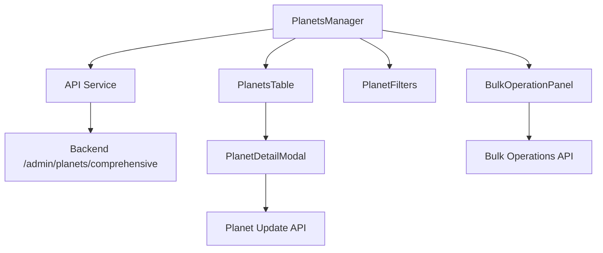

# Planet Management UI Enhancement Plan
**Date:** 2025-05-25
**Feature:** Enhanced Admin UI Planet Management
**Phase:** 2 - Detailed Planning

## Overview
Comprehensive enhancement of the Planet Management interface in the Admin UI to provide full administrative control over planets with improved user experience and functionality.

## Current State Analysis
- Basic table with limited planet data
- Non-functional action buttons
- Simple search/filter capabilities
- Missing detailed views and editing capabilities
- No bulk operations support

## Technical Design

### 1. Enhanced Data Model Integration
```typescript
interface EnhancedPlanet {
  id: string;
  name: string;
  sector_id: string;
  sector_name?: string;
  planet_type: string;
  population: number;
  max_population: number;
  defense_level: number;
  resource_production: number;
  owner_id?: string;
  owner_name?: string;
  created_at: string;
  is_habitable: boolean;
  atmosphere: string;
  gravity: number;
  // Additional fields from backend
  habitability_score: number;
  resource_richness: number;
  genesis_created: boolean;
  colonized_at?: string;
}
```

### 2. Component Architecture
```
PlanetsManager (main component)
├── PlanetsTable (enhanced table with sorting)
├── PlanetDetailModal (detailed view/edit)
├── PlanetFilters (advanced filtering)
├── BulkOperationPanel (multi-select actions)
└── PlanetMetrics (summary statistics)
```

### 3. New Components to Create

#### 3.1 PlanetDetailModal.tsx
- Full planet information display
- Inline editing capabilities
- Owner management
- Resource and production details
- Historical data if available

#### 3.2 Enhanced Filtering System
- Multi-column search
- Advanced filters (habitability range, resource richness, etc.)
- Saved filter presets
- Export capabilities

#### 3.3 Bulk Operations Panel
- Multi-select functionality
- Batch operations (delete, transfer ownership, etc.)
- Confirmation dialogs for destructive actions

### 4. API Integration Updates
- Use `/api/v1/admin/planets/comprehensive` endpoint
- Implement planet detail fetching
- Add planet update/delete endpoints
- Implement bulk operation endpoints

### 5. UI/UX Enhancements
- Responsive design improvements
- Better visual indicators for planet status
- Color-coded planet types
- Interactive tooltips
- Progress indicators for actions

## Implementation Tasks

### Phase 3A: Core Functionality (High Priority)
1. **Enhanced PlanetsManager Component**
   - Integrate comprehensive API endpoint
   - Add missing data fields to table
   - Implement proper error handling
   - Add loading states

2. **Functional Action Buttons**
   - View button → Open detail modal
   - Edit button → Enable inline editing
   - Delete button → Confirmation dialog + API call

3. **Planet Detail Modal**
   - Create comprehensive detail view
   - Add editing capabilities
   - Implement save/cancel functionality
   - Add validation

### Phase 3B: Advanced Features (Medium Priority)
4. **Advanced Filtering & Sorting**
   - Multi-column sorting
   - Range filters for numeric values
   - Date range filtering
   - Search across all visible fields

5. **Bulk Operations**
   - Multi-select checkboxes
   - Bulk action toolbar
   - Confirmation dialogs
   - Progress indicators

6. **Enhanced Visual Design**
   - Improved status indicators
   - Planet type icons/colors
   - Responsive table design
   - Better mobile experience

### Phase 3C: Polish & Performance (Low Priority)
7. **Performance Optimizations**
   - Virtual scrolling for large datasets
   - Debounced search
   - Optimistic updates
   - Caching strategies

8. **Additional Features**
   - Export to CSV/JSON
   - Column visibility toggles
   - Saved views/filters
   - Quick action shortcuts

## Data Flow Architecture



## API Requirements

### Current API: GET /api/v1/admin/planets/comprehensive
✅ Already provides necessary data including habitability_score, resource_richness, genesis_created

### New APIs Needed:
1. `GET /api/v1/admin/planets/{id}` - Get detailed planet info
2. `PUT /api/v1/admin/planets/{id}` - Update planet
3. `DELETE /api/v1/admin/planets/{id}` - Delete planet
4. `POST /api/v1/admin/planets/bulk` - Bulk operations

## Testing Strategy

### Unit Tests
- Component rendering with various data states
- Filter and search functionality
- Modal open/close behaviors
- API integration mocks

### Integration Tests
- Full CRUD operations workflow
- Bulk operations end-to-end
- Error handling scenarios
- Performance with large datasets

### E2E Tests
- Complete admin workflow
- Cross-browser compatibility
- Mobile responsiveness
- API error scenarios

## Risk Assessment

### Medium Risk
- **API Compatibility**: Backend APIs may need updates for full functionality
- **Performance**: Large planet datasets could impact table performance
- **User Experience**: Complex interface might overwhelm users

### Mitigation Strategies
- Progressive enhancement approach
- Performance monitoring and optimization
- User feedback integration during development
- Comprehensive testing at each phase

## Success Criteria

### Functional Requirements
- ✅ All planet data properly displayed
- ✅ Functional CRUD operations
- ✅ Advanced filtering and sorting
- ✅ Bulk operations working
- ✅ Responsive design

### Performance Requirements
- ⚡ Table loads < 2 seconds with 1000+ planets
- ⚡ Search responds < 500ms
- ⚡ Modal opens < 300ms

### User Experience Requirements
- 📱 Mobile-friendly interface
- 🎯 Intuitive navigation
- ⚠️ Clear error messages
- ✨ Smooth animations and transitions

## Timeline Estimate
- **Phase 3A**: 4-6 hours (core functionality)
- **Phase 3B**: 3-4 hours (advanced features) 
- **Phase 3C**: 2-3 hours (polish)
- **Testing**: 2-3 hours
- **Total**: 11-16 hours

## Dependencies
- Backend API enhancements (if needed)
- Design system components
- Testing infrastructure
- Code review and approval process