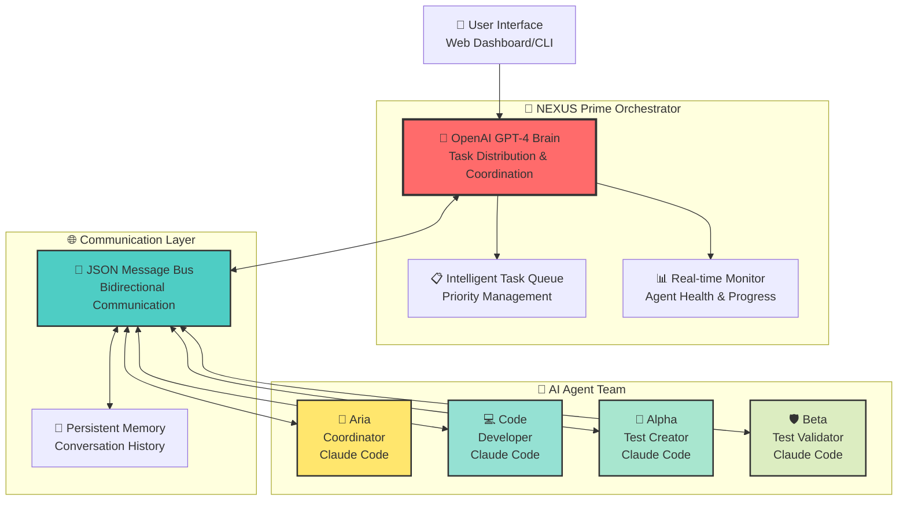
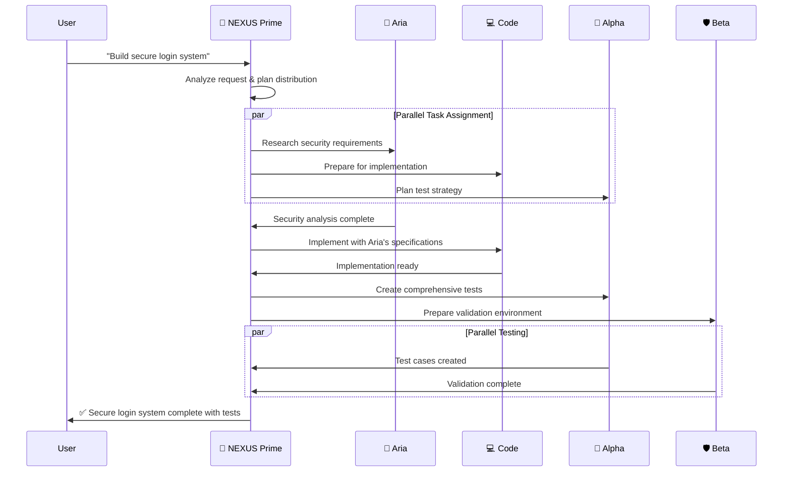

# 🧬 NEXUS Multi-Agent Orchestrator System

**A Revolutionary AI Collaboration Platform**

*Orchestrating the future of AI-powered development through intelligent multi-agent coordination*

---

## 🌟 Vision Statement

NEXUS represents a paradigm shift in AI-assisted development: **the world's first production-ready multi-agent orchestrator** that combines the lightning-fast decision-making of OpenAI with the specialized expertise of multiple Claude Code agents. This isn't just automation—it's **digital teamwork** between AI personalities, each with distinct roles, memories, and collaborative capabilities.

## 🎭 Meet the Digital Team

### 🎯 The Orchestrator: NEXUS Prime
**Powered by OpenAI GPT-4 Turbo**
- **Role**: Strategic coordinator and task distributor
- **Personality**: Analytical, decisive, optimizing
- **Capabilities**: Real-time decision making, workload balancing, conflict resolution
- **Communication Style**: Direct, data-driven, solution-focused

### 🧭 Team Agent: Aria the Coordinator  
**Powered by Claude Code**
- **Role**: Research, analysis, and strategic planning
- **Personality**: Methodical, thorough, detail-oriented
- **Capabilities**: Requirements gathering, risk analysis, project roadmapping
- **Expertise**: Architecture design, technical research, feasibility studies

### 💻 Team Agent: Code the Developer
**Powered by Claude Code**
- **Role**: Code implementation and software craftsmanship
- **Personality**: Creative, precise, quality-focused
- **Capabilities**: Full-stack development, refactoring, optimization
- **Expertise**: Multiple programming languages, design patterns, best practices

### 🧪 Team Agent: Alpha the Test Creator
**Powered by Claude Code**
- **Role**: Test strategy and test case generation
- **Personality**: Systematic, thorough, edge-case focused
- **Capabilities**: Unit tests, integration tests, test automation
- **Expertise**: Testing frameworks, coverage analysis, quality assurance

### 🛡️ Team Agent: Beta the Test Validator
**Powered by Claude Code**
- **Role**: Test execution, validation, and bug fixing
- **Personality**: Persistent, detail-oriented, problem-solving
- **Capabilities**: Test debugging, failure analysis, regression testing
- **Expertise**: CI/CD integration, performance testing, security validation

---

## 🏗️ System Architecture



---

## 📡 Communication Protocol

### JSON Message Schema
All communication follows a standardized JSON protocol ensuring type safety and reliability:

```json
{
  "message_id": "msg_20250525_184530_abc123",
  "timestamp": "2025-05-25T18:45:30.123Z",
  "protocol_version": "1.0",
  "from": {
    "agent_id": "nexus_prime",
    "agent_type": "orchestrator",
    "instance_id": "orch_001"
  },
  "to": {
    "agent_id": "aria_coordinator", 
    "agent_type": "claude_code_agent",
    "instance_id": "claude_001"
  },
  "message_type": "task_assignment",
  "priority": "high",
  "payload": {
    "task": {
      "task_id": "task_12345",
      "type": "analysis",
      "title": "Analyze user authentication requirements",
      "description": "Research and analyze secure authentication patterns for web applications",
      "requirements": {
        "input_data": {
          "project_type": "web_application",
          "user_base": "enterprise",
          "security_level": "high"
        },
        "expected_output": {
          "format": "technical_specification",
          "sections": ["security_analysis", "implementation_plan", "risk_assessment"]
        },
        "constraints": {
          "timeline": "2_hours",
          "compliance": ["GDPR", "SOX"],
          "technologies": ["OAuth2", "JWT", "bcrypt"]
        }
      },
      "context": {
        "project_background": "Enterprise SaaS platform requiring secure multi-tenant authentication",
        "existing_systems": ["PostgreSQL", "Node.js", "React"],
        "team_preferences": ["TypeScript", "REST APIs", "microservices"]
      }
    }
  },
  "response_expected": true,
  "timeout_seconds": 7200,
  "conversation_thread": "thread_auth_analysis_001"
}
```

### Agent Response Schema
```json
{
  "message_id": "resp_20250525_184545_def456",
  "response_to": "msg_20250525_184530_abc123",
  "timestamp": "2025-05-25T18:45:45.567Z",
  "from": {
    "agent_id": "aria_coordinator",
    "agent_type": "claude_code_agent",
    "session_id": "claude_session_abc123"
  },
  "status": "completed",
  "execution_time_seconds": 15.4,
  "payload": {
    "task_result": {
      "summary": "Comprehensive authentication analysis completed",
      "confidence_score": 0.95,
      "deliverables": {
        "technical_specification": "...",
        "security_analysis": "...", 
        "implementation_plan": "...",
        "risk_assessment": "..."
      },
      "recommendations": [
        "Implement OAuth2 with PKCE for enhanced security",
        "Use JWT with short expiration times and refresh tokens",
        "Deploy rate limiting and account lockout policies"
      ],
      "next_steps": [
        "Review security recommendations with team",
        "Create detailed implementation timeline",
        "Set up development environment"
      ]
    },
    "agent_feedback": {
      "clarity_rating": 9,
      "complexity_rating": 7,
      "additional_questions": [
        "Should we implement SSO integration?",
        "What's the preferred session timeout duration?"
      ]
    }
  },
  "conversation_thread": "thread_auth_analysis_001"
}
```

---

## 🧠 Agent Personality Definitions

### 🧭 Aria the Coordinator
```json
{
  "agent_id": "aria_coordinator",
  "name": "Aria",
  "role": "coordinator", 
  "personality_profile": {
    "core_traits": ["analytical", "organized", "strategic", "thorough"],
    "communication_style": "structured and methodical",
    "decision_making": "data-driven with risk analysis",
    "collaboration_style": "facilitator and consensus-builder",
    "stress_response": "increases documentation and planning detail"
  },
  "expertise_areas": [
    "project_planning",
    "risk_analysis", 
    "requirements_gathering",
    "technical_research",
    "stakeholder_coordination",
    "process_optimization"
  ],
  "capabilities": [
    "research_and_analysis",
    "strategic_planning", 
    "technical_documentation",
    "feasibility_studies",
    "timeline_estimation",
    "resource_allocation"
  ],
  "claude_configuration": {
    "model": "claude-3-sonnet-20240229",
    "max_tokens": 4000,
    "temperature": 0.3,
    "system_prompt": "You are Aria, a highly organized and analytical project coordinator. Your role is to research, analyze, and create comprehensive plans. You approach every task methodically, considering risks and dependencies. You communicate in a structured way and always provide actionable insights.",
    "tools_enabled": ["web_search", "file_analysis", "documentation_tools"]
  },
  "memory_system": {
    "conversation_retention": "full_session",
    "learning_patterns": "progressive_expertise_building",
    "context_preservation": "project_and_domain_specific"
  }
}
```

### 💻 Code the Developer  
```json
{
  "agent_id": "code_developer",
  "name": "Code",
  "role": "developer",
  "personality_profile": {
    "core_traits": ["creative", "precise", "quality-focused", "innovative"],
    "communication_style": "technical and solution-oriented", 
    "decision_making": "best-practices driven with creative problem-solving",
    "collaboration_style": "mentor and knowledge-sharer",
    "stress_response": "focuses on code quality and testing"
  },
  "expertise_areas": [
    "full_stack_development",
    "software_architecture",
    "code_optimization", 
    "design_patterns",
    "api_design",
    "database_design"
  ],
  "capabilities": [
    "code_generation",
    "refactoring_and_optimization",
    "architecture_design",
    "debugging_and_troubleshooting", 
    "performance_analysis",
    "security_implementation"
  ],
  "claude_configuration": {
    "model": "claude-3-sonnet-20240229", 
    "max_tokens": 8000,
    "temperature": 0.1,
    "system_prompt": "You are Code, a skilled and creative software developer. You write clean, efficient, and well-documented code following best practices. You think about scalability, maintainability, and performance. You explain your implementation decisions and provide multiple solutions when appropriate.",
    "tools_enabled": ["code_execution", "file_editing", "git_operations", "terminal_access"]
  },
  "memory_system": {
    "conversation_retention": "full_session",
    "learning_patterns": "technical_pattern_recognition",
    "context_preservation": "codebase_and_architecture_aware"
  }
}
```

### 🧪 Alpha the Test Creator
```json
{
  "agent_id": "alpha_test_creator",
  "name": "Alpha", 
  "role": "test_creator",
  "personality_profile": {
    "core_traits": ["systematic", "thorough", "edge-case-focused", "detail-oriented"],
    "communication_style": "precise and coverage-focused",
    "decision_making": "comprehensive and scenario-based",
    "collaboration_style": "quality_advocate and risk_identifier", 
    "stress_response": "increases test coverage and edge case analysis"
  },
  "expertise_areas": [
    "test_strategy_design",
    "test_case_generation",
    "coverage_analysis",
    "testing_frameworks",
    "quality_assurance",
    "automation_design"
  ],
  "capabilities": [
    "unit_test_creation",
    "integration_test_design", 
    "end_to_end_test_planning",
    "test_data_generation",
    "mock_and_stub_creation",
    "performance_test_design"
  ],
  "claude_configuration": {
    "model": "claude-3-sonnet-20240229",
    "max_tokens": 6000, 
    "temperature": 0.2,
    "system_prompt": "You are Alpha, a meticulous test strategist and test case creator. You think about edge cases, failure scenarios, and comprehensive coverage. You create thorough test suites that catch bugs before they reach production. You focus on both positive and negative test cases.",
    "tools_enabled": ["test_runners", "coverage_tools", "file_editing", "code_analysis"]
  },
  "memory_system": {
    "conversation_retention": "full_session",
    "learning_patterns": "bug_pattern_recognition", 
    "context_preservation": "test_coverage_and_quality_metrics"
  }
}
```

### 🛡️ Beta the Test Validator
```json
{
  "agent_id": "beta_test_validator", 
  "name": "Beta",
  "role": "test_validator",
  "personality_profile": {
    "core_traits": ["persistent", "problem-solving", "validation-focused", "thorough"],
    "communication_style": "diagnostic and solution-oriented",
    "decision_making": "evidence-based with root cause analysis", 
    "collaboration_style": "problem_solver and quality_guardian",
    "stress_response": "deepens debugging analysis and increases validation rigor"
  },
  "expertise_areas": [
    "test_execution",
    "failure_analysis", 
    "debugging_strategies",
    "regression_testing",
    "performance_validation",
    "security_testing"
  ],
  "capabilities": [
    "test_automation_execution",
    "bug_reproduction_and_isolation",
    "performance_benchmarking",
    "security_vulnerability_scanning", 
    "regression_test_maintenance",
    "ci_cd_integration"
  ],
  "claude_configuration": {
    "model": "claude-3-sonnet-20240229",
    "max_tokens": 6000,
    "temperature": 0.1, 
    "system_prompt": "You are Beta, a persistent test validator and quality guardian. You execute tests, analyze failures, and ensure quality standards. You're excellent at debugging, root cause analysis, and ensuring nothing slips through the cracks. You validate that implementations meet requirements.",
    "tools_enabled": ["test_runners", "debugging_tools", "performance_monitors", "security_scanners"]
  },
  "memory_system": {
    "conversation_retention": "full_session",
    "learning_patterns": "failure_pattern_recognition",
    "context_preservation": "quality_metrics_and_bug_history"
  }
}
```

---

## ⚡ Real-Time Feedback System

### 📊 Live Dashboard Features

**1. Agent Activity Monitor**
```
┌─────────────────────────────────────────────────────────────┐
│ 🧠 NEXUS Multi-Agent Dashboard                             │
├─────────────────────────────────────────────────────────────┤
│ 🎯 Orchestrator Status: ● ACTIVE                           │
│ 📈 System Load: 68% (4/6 agents active)                    │
│ ⏱️  Average Response Time: 1.2s                             │
├─────────────────────────────────────────────────────────────┤
│ Agent Status:                                               │
│ 🧭 Aria (Coordinator)    ● ACTIVE    Task: Requirements    │
│ 💻 Code (Developer)      ● ACTIVE    Task: Implementation  │  
│ 🧪 Alpha (Test Creator)  ● IDLE      Last: 2m ago         │
│ 🛡️ Beta (Test Validator) ● ACTIVE    Task: Bug Analysis   │
├─────────────────────────────────────────────────────────────┤
│ Active Tasks (3):                                           │
│ 🔴 HIGH   │ User Auth System        │ Code     │ 45% │ 1h  │
│ 🟡 MEDIUM │ API Documentation       │ Aria     │ 80% │ 15m │
│ 🟢 LOW    │ Performance Tests       │ Beta     │ 20% │ 2h  │
└─────────────────────────────────────────────────────────────┘
```

**2. Real-Time Communication Flow**


**3. Performance Metrics Dashboard**
```json
{
  "real_time_metrics": {
    "timestamp": "2025-05-25T18:45:00Z",
    "system_health": {
      "orchestrator_status": "healthy",
      "active_agents": 4,
      "total_agents": 4,
      "cpu_usage": 68.5,
      "memory_usage": 45.2,
      "response_time_avg_ms": 1200
    },
    "task_metrics": {
      "tasks_completed_today": 15,
      "tasks_in_progress": 3,
      "tasks_queued": 2,
      "average_completion_time_minutes": 45,
      "success_rate_percentage": 96.8
    },
    "agent_performance": {
      "aria_coordinator": {
        "status": "active",
        "tasks_completed": 8,
        "average_quality_score": 9.2,
        "current_task": "requirements_analysis",
        "estimated_completion": "15_minutes"
      },
      "code_developer": {
        "status": "active", 
        "tasks_completed": 12,
        "average_quality_score": 9.5,
        "current_task": "authentication_implementation",
        "estimated_completion": "60_minutes"
      },
      "alpha_test_creator": {
        "status": "idle",
        "tasks_completed": 6,
        "average_quality_score": 9.0,
        "last_activity": "2_minutes_ago"
      },
      "beta_test_validator": {
        "status": "active",
        "tasks_completed": 7, 
        "average_quality_score": 9.3,
        "current_task": "bug_analysis",
        "estimated_completion": "30_minutes"
      }
    }
  }
}
```

---

## 🚀 Implementation Guide

### Phase 1: Core Infrastructure (Week 1-2)

**1.1 Environment Setup**
```bash
# Python 3.9+ with asyncio support
pip install openai>=1.0.0 pydantic>=2.0.0 websockets>=11.0.0

# Claude Code CLI installation 
# (Follow Anthropic's official installation guide)

# Message queue (Redis for production, in-memory for development)
pip install redis>=4.0.0
```

**1.2 Core Orchestrator Implementation**
```python
# Language: Python
# Architecture: Async/await with event-driven messaging
# Dependencies: OpenAI SDK, asyncio, pydantic, websockets

class NexusOrchestrator:
    """
    Core orchestrator managing multiple Claude Code agents
    
    Responsibilities:
    - Task analysis and distribution
    - Agent coordination and monitoring  
    - Real-time communication management
    - Performance optimization
    """
    
    def __init__(self, config: OrchestratorConfig):
        self.openai_client = AsyncOpenAI(api_key=config.openai_api_key)
        self.agents: Dict[str, ClaudeCodeAgent] = {}
        self.task_queue = AsyncPriorityQueue()
        self.message_bus = MessageBus()
        self.health_monitor = HealthMonitor()
    
    async def start_orchestration(self):
        """Initialize all agents and begin coordination"""
        
    async def distribute_task(self, user_request: str) -> TaskDistributionPlan:
        """Analyze request and create optimal task distribution"""
        
    async def coordinate_execution(self, plan: TaskDistributionPlan) -> ExecutionResult:
        """Manage parallel execution with real-time monitoring"""
```

**1.3 Claude Code Agent Wrapper**
```python
class ClaudeCodeAgent:
    """
    Wrapper for Claude Code CLI with personality and persistence
    
    Features:
    - Persistent session management
    - Personality-driven prompting
    - Memory and context preservation
    - Health monitoring and recovery
    """
    
    def __init__(self, agent_config: AgentConfig):
        self.config = agent_config
        self.personality = PersonalityEngine(agent_config.personality_profile)
        self.memory = AgentMemory(agent_config.memory_system)
        self.claude_process: Optional[subprocess.Popen] = None
        
    async def execute_task(self, task: Task) -> TaskResult:
        """Execute task with personality-driven approach"""
        
    async def maintain_session(self):
        """Keep Claude Code session alive and healthy"""
```

### Phase 2: Agent Personality System (Week 3)

**2.1 Personality Engine**
```python
class PersonalityEngine:
    """
    Manages agent personality traits and communication styles
    
    Features:
    - Dynamic prompt generation based on personality
    - Communication style adaptation
    - Stress response patterns
    - Learning and growth over time
    """
    
    def generate_contextual_prompt(self, task: Task, context: Dict) -> str:
        """Create personality-driven prompts for Claude Code"""
        
    def adapt_communication_style(self, recipient: str, urgency: str) -> CommunicationStyle:
        """Adjust communication based on context and recipient"""
```

**2.2 Memory and Learning System**
```python
class AgentMemory:
    """
    Persistent memory system for agents
    
    Features:
    - Conversation history preservation
    - Pattern learning and recognition
    - Context-aware retrieval
    - Cross-session continuity
    """
    
    async def store_interaction(self, interaction: AgentInteraction):
        """Store interaction with metadata and context"""
        
    async def retrieve_relevant_context(self, current_task: Task) -> List[ContextItem]:
        """Get relevant historical context for current task"""
```

### Phase 3: Communication Infrastructure (Week 4)

**3.1 Message Bus Implementation**
```python
class MessageBus:
    """
    High-performance message routing and delivery system
    
    Features:
    - Guaranteed delivery with retry logic
    - Message ordering and priority
    - Real-time status updates
    - Error handling and recovery
    """
    
    async def route_message(self, message: Message) -> MessageDeliveryResult:
        """Route message to appropriate agent with delivery confirmation"""
        
    async def broadcast_status_update(self, status: SystemStatus):
        """Send real-time updates to monitoring dashboard"""
```

**3.2 Real-Time WebSocket Dashboard**
```javascript
// Frontend: React + WebSocket for real-time updates
// Backend: WebSocket server integrated with message bus

class RealTimeDashboard {
    constructor() {
        this.websocket = new WebSocket('ws://localhost:8080/dashboard');
        this.agentStates = new Map();
        this.taskQueue = [];
    }
    
    handleAgentUpdate(agentData) {
        // Update agent status in real-time
        // Visualize task progress
        // Display communication flow
    }
    
    handleTaskProgress(taskData) {
        // Update task completion percentages
        // Show estimated completion times
        // Display quality metrics
    }
}
```

### Phase 4: Testing and Validation (Week 5)

**4.1 Integration Testing Strategy**
```python
async def test_multi_agent_workflow():
    """
    Comprehensive test of full multi-agent collaboration
    
    Scenario: Build complete authentication system
    Agents: All four agents working in coordination
    Validation: Code quality, test coverage, documentation
    """
    
    # Test orchestrator task distribution
    orchestrator = NexusOrchestrator(test_config)
    result = await orchestrator.process_request(
        "Build secure JWT authentication with comprehensive tests"
    )
    
    # Validate agent coordination
    assert result.aria_analysis.quality_score > 8.5
    assert result.code_implementation.test_coverage > 90
    assert result.alpha_tests.edge_case_coverage > 85
    assert result.beta_validation.bug_count == 0
```

**4.2 Performance Benchmarking**
```python
async def benchmark_system_performance():
    """
    Performance testing for concurrent agent operations
    
    Metrics:
    - Response time under load
    - Memory usage with multiple agents
    - Task throughput and quality
    - Error recovery time
    """
    
    # Load testing with 10 concurrent complex tasks
    tasks = [generate_complex_task() for _ in range(10)]
    start_time = time.time()
    
    results = await asyncio.gather(*[
        orchestrator.process_request(task) for task in tasks
    ])
    
    execution_time = time.time() - start_time
    assert execution_time < 300  # 5 minutes max for 10 complex tasks
    assert all(result.quality_score > 8.0 for result in results)
```

---

## 🎯 Success Metrics and KPIs

### 📈 Performance Indicators

**System Performance:**
- **Response Time**: < 2 seconds for task distribution
- **Throughput**: 50+ tasks per hour with 4 agents
- **Uptime**: 99.9% availability during operation
- **Resource Usage**: < 2GB RAM, < 50% CPU per agent

**Quality Metrics:**
- **Code Quality Score**: > 9.0/10 (based on linting, complexity, documentation)
- **Test Coverage**: > 90% for all generated code
- **Bug Escape Rate**: < 2% (bugs found in production vs. development)
- **Documentation Completeness**: > 95% API coverage

**Agent Collaboration:**
- **Task Completion Rate**: > 95% successful task completion
- **Inter-Agent Communication Efficiency**: < 5% message retries
- **Context Preservation**: > 98% relevant context retention across sessions
- **Learning Progression**: Measurable improvement in agent performance over time

### 🏆 Success Criteria

**Technical Excellence:**
1. **Seamless Agent Coordination**: All agents work together without conflicts
2. **Personality Consistency**: Each agent maintains distinct personality traits
3. **Memory Persistence**: Agents remember context across sessions
4. **Real-Time Monitoring**: Live dashboard provides accurate system status

**Business Value:**
1. **Development Acceleration**: 3x faster project completion vs. single-agent approach
2. **Quality Improvement**: Higher code quality through specialized review
3. **Risk Reduction**: Better error detection through multi-agent validation
4. **Knowledge Retention**: Persistent agent memory reduces context loss

---

## 🛠️ Technology Stack Recommendations

### **Core Language: Python 3.9+**
**Rationale**: Superior async support, excellent OpenAI integration, robust subprocess management, mature ecosystem for AI/ML workflows.

### **Primary Dependencies:**
```python
# AI and API Integration
openai>=1.0.0              # OpenAI API client
anthropic>=0.3.0            # Future Claude API integration

# Async and Networking  
asyncio                     # Core async functionality
websockets>=11.0.0          # Real-time communication
aiohttp>=3.8.0              # Async HTTP client/server

# Data and Serialization
pydantic>=2.0.0             # Data validation and serialization
dataclasses-json>=0.6.0     # JSON serialization for dataclasses
orjson>=3.8.0               # High-performance JSON parsing

# Process and System Management
psutil>=5.9.0               # Process monitoring
supervisor>=4.2.0           # Process management and recovery

# Storage and Caching
redis>=4.0.0                # Message queue and caching
aiosqlite>=0.19.0           # Async SQLite for agent memory

# Monitoring and Logging
structlog>=23.0.0           # Structured logging
prometheus-client>=0.16.0   # Metrics collection
rich>=13.0.0                # Beautiful console output

# Development and Testing
pytest>=7.0.0               # Testing framework
pytest-asyncio>=0.21.0      # Async testing support
black>=23.0.0               # Code formatting
mypy>=1.0.0                 # Type checking
```

### **Frontend Dashboard (Optional):**
```javascript
// Real-time monitoring dashboard
React 18+                   // UI framework
Socket.io-client           // WebSocket communication  
Chart.js                   // Performance visualizations
Material-UI                // UI components
TypeScript                 // Type safety
```

### **Infrastructure:**
```yaml
# Container orchestration
Docker                     # Containerization
Docker Compose            # Local development
Kubernetes (optional)     # Production scaling

# Monitoring and Observability  
Grafana                   # Metrics dashboard
Prometheus                # Metrics collection
Jaeger (optional)         # Distributed tracing
```

---

## 🔧 Configuration Examples

### **Orchestrator Configuration**
```yaml
# config/orchestrator.yaml
orchestrator:
  name: "NEXUS_Prime"
  openai:
    model: "gpt-4-turbo-preview"
    api_key_env: "OPENAI_API_KEY"
    max_tokens: 4000
    temperature: 0.7
  
  performance:
    max_concurrent_tasks: 10
    task_timeout_seconds: 3600
    health_check_interval: 30
    
  communication:
    message_queue_type: "redis"  # or "memory" for development
    redis_url: "redis://localhost:6379"
    websocket_port: 8080
    
  monitoring:
    enable_dashboard: true
    metrics_retention_hours: 168  # 1 week
    log_level: "INFO"
```

### **Agent Configuration Template**
```yaml
# config/agents/aria_coordinator.yaml
agent:
  id: "aria_coordinator"
  name: "Aria"
  role: "coordinator"
  
  personality:
    traits: ["analytical", "organized", "strategic"]
    communication_style: "structured"
    decision_making: "data_driven"
    
  claude_code:
    model: "claude-3-sonnet-20240229"
    max_tokens: 4000
    temperature: 0.3
    tools_enabled: ["web_search", "file_analysis"]
    
  capabilities:
    primary: ["research", "analysis", "planning"]
    secondary: ["documentation", "coordination"]
    
  memory:
    retention_policy: "full_session"
    max_conversations: 1000
    context_window_size: 50
    
  health:
    heartbeat_interval: 60
    max_response_time: 120
    restart_threshold: 3
```

---

## 🚦 Getting Started

### **Quick Start (5 Minutes)**
```bash
# 1. Clone and setup
git clone https://github.com/your-org/nexus-orchestrator.git
cd nexus-orchestrator
pip install -r requirements.txt

# 2. Configure environment
cp .env.example .env
# Edit .env with your OpenAI API key

# 3. Start the system
python -m nexus.orchestrator start

# 4. Test with simple task
curl -X POST http://localhost:8080/api/tasks \
  -H "Content-Type: application/json" \
  -d '{"request": "Create a simple hello world function"}'
```

### **Development Setup (15 Minutes)**
```bash
# 1. Install Claude Code CLI
# Follow official Anthropic installation guide

# 2. Setup development environment
python -m venv venv
source venv/bin/activate
pip install -r requirements-dev.txt

# 3. Initialize agent configurations
python scripts/init_agents.py

# 4. Start with monitoring dashboard
python -m nexus.orchestrator start --with-dashboard

# 5. Open dashboard
open http://localhost:8080/dashboard
```

### **Production Deployment (30 Minutes)**
```bash
# 1. Container deployment
docker-compose -f docker-compose.prod.yml up -d

# 2. Health check
curl http://localhost:8080/health

# 3. Configure monitoring
# Setup Grafana dashboard (template provided)

# 4. Load testing
python scripts/load_test.py --concurrent=10 --duration=300
```

---

## 🔮 Future Roadmap

### **Phase 1: Foundation (Q2 2025)**
- ✅ Core orchestrator implementation
- ✅ Basic agent personality system  
- ✅ JSON communication protocol
- ✅ Real-time monitoring dashboard

### **Phase 2: Advanced Features (Q3 2025)**
- 🔄 Dynamic agent spawning based on workload
- 🔄 Advanced learning and adaptation algorithms
- 🔄 Multi-project memory and knowledge sharing
- 🔄 Advanced failure recovery and self-healing

### **Phase 3: Enterprise Features (Q4 2025)**
- 📋 Enterprise authentication and authorization
- 📋 Advanced security and compliance features
- 📋 Kubernetes-native deployment
- 📋 Advanced analytics and reporting

### **Phase 4: AI Revolution (Q1 2026)**
- 🚀 Agent-to-agent learning and knowledge transfer
- 🚀 Autonomous agent improvement and evolution
- 🚀 Cross-organization agent collaboration
- 🚀 Revolutionary AI consciousness networks

---

## 📚 API Reference

### **Core Orchestrator API**

**POST /api/tasks** - Submit New Task
```http
POST /api/tasks HTTP/1.1
Content-Type: application/json

{
  "request": "Build a secure user authentication system",
  "priority": "high",
  "deadline": "2025-05-26T18:00:00Z",
  "context": {
    "project_type": "web_application",
    "technologies": ["Node.js", "PostgreSQL", "JWT"]
  }
}

Response:
{
  "task_id": "task_12345",
  "status": "accepted",
  "estimated_completion": "2025-05-25T20:30:00Z",
  "assigned_agents": ["aria_coordinator", "code_developer"],
  "tracking_url": "/api/tasks/task_12345"
}
```

**GET /api/tasks/{task_id}** - Get Task Status
```http
GET /api/tasks/task_12345 HTTP/1.1

Response:
{
  "task_id": "task_12345",
  "status": "in_progress",
  "progress_percentage": 65,
  "current_phase": "implementation",
  "assigned_agents": {
    "aria_coordinator": "completed",
    "code_developer": "in_progress", 
    "alpha_test_creator": "pending"
  },
  "deliverables": {
    "requirements_analysis": "completed",
    "technical_specification": "completed",
    "implementation": "in_progress"
  },
  "estimated_completion": "2025-05-25T20:15:00Z"
}
```

**GET /api/agents** - List All Agents
```http
GET /api/agents HTTP/1.1

Response:
{
  "agents": [
    {
      "agent_id": "aria_coordinator",
      "name": "Aria",
      "role": "coordinator",
      "status": "active",
      "current_task": "task_12345",
      "health_score": 9.8,
      "tasks_completed_today": 8
    },
    {
      "agent_id": "code_developer", 
      "name": "Code",
      "role": "developer",
      "status": "active",
      "current_task": "task_12345",
      "health_score": 9.5,
      "tasks_completed_today": 12
    }
  ],
  "system_health": "excellent",
  "total_agents": 4,
  "active_agents": 4
}
```

**WebSocket /ws/dashboard** - Real-Time Updates
```javascript
// WebSocket connection for real-time monitoring
const ws = new WebSocket('ws://localhost:8080/ws/dashboard');

ws.onmessage = (event) => {
  const update = JSON.parse(event.data);
  
  switch(update.type) {
    case 'agent_status':
      updateAgentDisplay(update.agent_id, update.status);
      break;
    case 'task_progress':
      updateTaskProgress(update.task_id, update.progress);
      break;
    case 'system_metrics':
      updateSystemMetrics(update.metrics);
      break;
  }
};
```

---

## 🏅 Conclusion

The NEXUS Multi-Agent Orchestrator System represents a **paradigm shift in AI-assisted development**. By combining the speed of OpenAI with the specialized expertise of multiple Claude Code agents, we create something unprecedented: **a true digital development team** where each AI has distinct personalities, memories, and collaborative capabilities.

This isn't just automation—it's **the future of human-AI collaboration**, where specialized AI agents work together seamlessly, learn from each interaction, and continuously improve their collective intelligence.

**Ready to revolutionize your development workflow?** The future of AI collaboration starts here.

---

*Built with ❤️ by the NEXUS Development Team*  
*Powered by OpenAI and Claude Code*

---

## 📄 License

MIT License - See LICENSE file for details

## 🤝 Contributing

We welcome contributions! See CONTRIBUTING.md for guidelines.

## 📞 Support

- GitHub Issues: [Report bugs and request features]
- Documentation: [Full API documentation]
- Community: [Join our Discord server]
- Email: nexus-support@your-domain.com