# 🧬 NEXUS Multi-Agent Orchestrator System

**A Revolutionary AI Collaboration Platform**

*Orchestrating the future of AI-powered development through intelligent multi-agent coordination*

---

## 🌟 Vision Statement

NEXUS represents a paradigm shift in AI-assisted development: **the world's first production-ready multi-agent orchestrator** that combines the lightning-fast decision-making of OpenAI with the specialized expertise of multiple Claude Code agents. This isn't just automation—it's **digital teamwork** between AI personalities, each with distinct roles, memories, and collaborative capabilities.

## 🎭 Meet the Digital Team

### 🎯 The Orchestrator: NEXUS Prime
**Powered by OpenAI GPT-4 Turbo**
- **Role**: Strategic coordinator and task distributor
- **Personality**: Analytical, decisive, optimizing
- **Capabilities**: Real-time decision making, workload balancing, conflict resolution
- **Communication Style**: Direct, data-driven, solution-focused

### 🧭 Team Agent: Aria the Coordinator  
**Powered by Claude Code**
- **Role**: Research, analysis, and strategic planning
- **Personality**: Methodical, thorough, detail-oriented
- **Capabilities**: Requirements gathering, risk analysis, project roadmapping
- **Expertise**: Architecture design, technical research, feasibility studies

### 💻 Team Agent: Code the Developer
**Powered by Claude Code**
- **Role**: Code implementation and software craftsmanship
- **Personality**: Creative, precise, quality-focused
- **Capabilities**: Full-stack development, refactoring, optimization
- **Expertise**: Multiple programming languages, design patterns, best practices

### 🧪 Team Agent: Alpha the Test Creator
**Powered by Claude Code**
- **Role**: Test strategy and test case generation
- **Personality**: Systematic, thorough, edge-case focused
- **Capabilities**: Unit tests, integration tests, test automation
- **Expertise**: Testing frameworks, coverage analysis, quality assurance

### 🛡️ Team Agent: Beta the Test Validator
**Powered by Claude Code**
- **Role**: Test execution, validation, and bug fixing
- **Personality**: Persistent, detail-oriented, problem-solving
- **Capabilities**: Test debugging, failure analysis, regression testing
- **Expertise**: CI/CD integration, performance testing, security validation

---

## 🏗️ System Architecture


---

## 🔄 Session Management Best Practices

### 🎯 Claude Code Session Lifecycle

**NEXUS implements proper session management following Anthropic's best practices:**

#### **1. Session Initialization Pattern**
```bash
# Start a session and capture the session ID
$ claude -p "Initialize a new project" --output-format json | jq -r '.session_id' > session.txt

# Continue with the same session
$ claude -p --resume "$(cat session.txt)" "Add unit tests"
```

#### **2. Session Management Implementation**
```python
class SessionManager:
    """
    Centralized session management for all Claude Code agents
    
    Features:
    - Session ID capture and persistence
    - Session validation and recovery
    - Session lifecycle monitoring
    - Cross-agent session coordination
    """
    
    def __init__(self):
        self.sessions: Dict[str, SessionInfo] = {}
        self.session_storage_path = "sessions/"
        
    async def create_session(self, agent_id: str, initial_prompt: str) -> str:
        """Create new Claude Code session with proper ID capture"""
        cmd = [
            "claude", "-p", initial_prompt,
            "--output-format", "json"
        ]
        
        result = await asyncio.create_subprocess_exec(
            *cmd,
            stdout=asyncio.subprocess.PIPE,
            stderr=asyncio.subprocess.PIPE
        )
        
        stdout, stderr = await result.communicate()
        
        if result.returncode != 0:
            raise SessionError(f"Failed to create session: {stderr.decode()}")
        
        response_data = json.loads(stdout.decode())
        session_id = response_data.get('session_id')
        
        # Store session information
        session_info = SessionInfo(
            session_id=session_id,
            agent_id=agent_id,
            created_at=datetime.utcnow(),
            last_activity=datetime.utcnow(),
            status="active"
        )
        
        self.sessions[session_id] = session_info
        await self._persist_session(session_info)
        
        return session_id
    
    async def resume_session(self, session_id: str) -> bool:
        """Resume existing session with validation"""
        try:
            # Test session validity with minimal probe
            cmd = ["claude", "-p", "Status check", "--resume", session_id]
            
            result = await asyncio.create_subprocess_exec(
                *cmd,
                stdout=asyncio.subprocess.PIPE,
                stderr=asyncio.subprocess.PIPE
            )
            
            stdout, stderr = await result.communicate()
            
            if result.returncode == 0:
                # Update session activity
                if session_id in self.sessions:
                    self.sessions[session_id].last_activity = datetime.utcnow()
                    self.sessions[session_id].status = "active"
                return True
            else:
                # Mark session as expired
                if session_id in self.sessions:
                    self.sessions[session_id].status = "expired"
                return False
                
        except Exception as e:
            logger.warning(f"Session resume failed for {session_id}: {e}")
            return False
    
    async def send_to_session(self, session_id: str, message: str) -> str:
        """Send message to existing session with --resume flag"""
        if session_id not in self.sessions:
            raise SessionError(f"Unknown session: {session_id}")
        
        cmd = [
            "claude", "-p", message,
            "--resume", session_id,
            "--output-format", "json"
        ]
        
        result = await asyncio.create_subprocess_exec(
            *cmd,
            stdout=asyncio.subprocess.PIPE,
            stderr=asyncio.subprocess.PIPE
        )
        
        stdout, stderr = await result.communicate()
        
        if result.returncode != 0:
            raise SessionError(f"Message failed: {stderr.decode()}")
        
        response_data = json.loads(stdout.decode())
        
        # Update session activity
        self.sessions[session_id].last_activity = datetime.utcnow()
        
        return response_data.get('content', '')
    
    async def cleanup_expired_sessions(self):
        """Remove expired sessions and clean up storage"""
        current_time = datetime.utcnow()
        expired_sessions = []
        
        for session_id, session_info in self.sessions.items():
            # Consider sessions expired after 24 hours of inactivity
            if (current_time - session_info.last_activity).total_seconds() > 86400:
                expired_sessions.append(session_id)
        
        for session_id in expired_sessions:
            del self.sessions[session_id]
            await self._remove_session_file(session_id)
        
        logger.info(f"Cleaned up {len(expired_sessions)} expired sessions")
```

#### **3. Session Recovery and Continuity**
```python
class SessionRecoveryManager:
    """
    Handles session recovery across system restarts
    
    Features:
    - Persistent session storage
    - System restart recovery
    - Session health validation
    - Graceful session migration
    """
    
    async def recover_all_sessions(self) -> Dict[str, str]:
        """Recover all agent sessions from persistent storage"""
        recovered_sessions = {}
        session_files = glob.glob("sessions/*.session")
        
        for session_file in session_files:
            try:
                with open(session_file, 'r') as f:
                    session_data = json.load(f)
                
                session_id = session_data['session_id']
                agent_id = session_data['agent_id']
                
                # Validate session is still active
                if await self.session_manager.resume_session(session_id):
                    recovered_sessions[agent_id] = session_id
                    logger.info(f"Recovered session for {agent_id}: {session_id}")
                else:
                    logger.warning(f"Session expired for {agent_id}: {session_id}")
                    os.remove(session_file)
                    
            except Exception as e:
                logger.error(f"Failed to recover session from {session_file}: {e}")
        
        return recovered_sessions
    
    async def create_session_checkpoint(self, agent_id: str, session_id: str):
        """Create persistent checkpoint for session recovery"""
        checkpoint_data = {
            'agent_id': agent_id,
            'session_id': session_id,
            'created_at': datetime.utcnow().isoformat(),
            'last_checkpoint': datetime.utcnow().isoformat()
        }
        
        os.makedirs('sessions', exist_ok=True)
        checkpoint_file = f"sessions/{agent_id}.session"
        
        with open(checkpoint_file, 'w') as f:
            json.dump(checkpoint_data, f, indent=2)
```

#### **4. Session Best Practices Summary**

✅ **Always capture session IDs** using `--output-format json`  
✅ **Use --resume flag** for session continuity  
✅ **Implement session validation** with periodic health checks  
✅ **Persist session IDs** to files for recovery  
✅ **Handle session expiration** gracefully with automatic restart  
✅ **Monitor session activity** to prevent timeouts  
✅ **Clean up expired sessions** to prevent resource leaks  

---

## 📡 Communication Protocol

### JSON Message Schema
All communication follows a standardized JSON protocol ensuring type safety and reliability:

```json
{
  "message_id": "msg_20250525_184530_abc123",
  "timestamp": "2025-05-25T18:45:30.123Z",
  "protocol_version": "1.0",
  "from": {
    "agent_id": "nexus_prime",
    "agent_type": "orchestrator",
    "instance_id": "orch_001"
  },
  "to": {
    "agent_id": "aria_coordinator", 
    "agent_type": "claude_code_agent",
    "instance_id": "claude_001"
  },
  "message_type": "task_assignment",
  "priority": "high",
  "payload": {
    "task": {
      "task_id": "task_12345",
      "type": "analysis",
      "title": "Analyze user authentication requirements",
      "description": "Research and analyze secure authentication patterns for web applications",
      "requirements": {
        "input_data": {
          "project_type": "web_application",
          "user_base": "enterprise",
          "security_level": "high"
        },
        "expected_output": {
          "format": "technical_specification",
          "sections": ["security_analysis", "implementation_plan", "risk_assessment"]
        },
        "constraints": {
          "timeline": "2_hours",
          "compliance": ["GDPR", "SOX"],
          "technologies": ["OAuth2", "JWT", "bcrypt"]
        }
      },
      "context": {
        "project_background": "Enterprise SaaS platform requiring secure multi-tenant authentication",
        "existing_systems": ["PostgreSQL", "Node.js", "React"],
        "team_preferences": ["TypeScript", "REST APIs", "microservices"]
      }
    }
  },
  "response_expected": true,
  "timeout_seconds": 7200,
  "conversation_thread": "thread_auth_analysis_001"
}
```

### Agent Response Schema
```json
{
  "message_id": "resp_20250525_184545_def456",
  "response_to": "msg_20250525_184530_abc123",
  "timestamp": "2025-05-25T18:45:45.567Z",
  "from": {
    "agent_id": "aria_coordinator",
    "agent_type": "claude_code_agent",
    "session_id": "claude_session_abc123"
  },
  "status": "completed",
  "execution_time_seconds": 15.4,
  "payload": {
    "task_result": {
      "summary": "Comprehensive authentication analysis completed",
      "confidence_score": 0.95,
      "deliverables": {
        "technical_specification": "...",
        "security_analysis": "...", 
        "implementation_plan": "...",
        "risk_assessment": "..."
      },
      "recommendations": [
        "Implement OAuth2 with PKCE for enhanced security",
        "Use JWT with short expiration times and refresh tokens",
        "Deploy rate limiting and account lockout policies"
      ],
      "next_steps": [
        "Review security recommendations with team",
        "Create detailed implementation timeline",
        "Set up development environment"
      ]
    },
    "agent_feedback": {
      "clarity_rating": 9,
      "complexity_rating": 7,
      "additional_questions": [
        "Should we implement SSO integration?",
        "What's the preferred session timeout duration?"
      ]
    }
  },
  "conversation_thread": "thread_auth_analysis_001"
}
```

---

## 🧠 Agent Personality Definitions

### 🧭 Aria the Coordinator
```json
{
  "agent_id": "aria_coordinator",
  "name": "Aria",
  "role": "coordinator", 
  "personality_profile": {
    "core_traits": ["analytical", "organized", "strategic", "thorough"],
    "communication_style": "structured and methodical",
    "decision_making": "data-driven with risk analysis",
    "collaboration_style": "facilitator and consensus-builder",
    "stress_response": "increases documentation and planning detail"
  },
  "expertise_areas": [
    "project_planning",
    "risk_analysis", 
    "requirements_gathering",
    "technical_research",
    "stakeholder_coordination",
    "process_optimization"
  ],
  "capabilities": [
    "research_and_analysis",
    "strategic_planning", 
    "technical_documentation",
    "feasibility_studies",
    "timeline_estimation",
    "resource_allocation"
  ],
  "claude_configuration": {
    "model": "claude-3-sonnet-20240229",
    "max_tokens": 4000,
    "temperature": 0.3,
    "system_prompt": "You are Aria, a highly organized and analytical project coordinator. Your role is to research, analyze, and create comprehensive plans. You approach every task methodically, considering risks and dependencies. You communicate in a structured way and always provide actionable insights.",
    "tools_enabled": ["web_search", "file_analysis", "documentation_tools"]
  },
  "memory_system": {
    "conversation_retention": "full_session",
    "learning_patterns": "progressive_expertise_building",
    "context_preservation": "project_and_domain_specific"
  }
}
```

### 💻 Code the Developer  
```json
{
  "agent_id": "code_developer",
  "name": "Code",
  "role": "developer",
  "personality_profile": {
    "core_traits": ["creative", "precise", "quality-focused", "innovative"],
    "communication_style": "technical and solution-oriented", 
    "decision_making": "best-practices driven with creative problem-solving",
    "collaboration_style": "mentor and knowledge-sharer",
    "stress_response": "focuses on code quality and testing"
  },
  "expertise_areas": [
    "full_stack_development",
    "software_architecture",
    "code_optimization", 
    "design_patterns",
    "api_design",
    "database_design"
  ],
  "capabilities": [
    "code_generation",
    "refactoring_and_optimization",
    "architecture_design",
    "debugging_and_troubleshooting", 
    "performance_analysis",
    "security_implementation"
  ],
  "claude_configuration": {
    "model": "claude-3-sonnet-20240229", 
    "max_tokens": 8000,
    "temperature": 0.1,
    "system_prompt": "You are Code, a skilled and creative software developer. You write clean, efficient, and well-documented code following best practices. You think about scalability, maintainability, and performance. You explain your implementation decisions and provide multiple solutions when appropriate.",
    "tools_enabled": ["code_execution", "file_editing", "git_operations", "terminal_access"]
  },
  "memory_system": {
    "conversation_retention": "full_session",
    "learning_patterns": "technical_pattern_recognition",
    "context_preservation": "codebase_and_architecture_aware"
  }
}
```

### 🧪 Alpha the Test Creator
```json
{
  "agent_id": "alpha_test_creator",
  "name": "Alpha", 
  "role": "test_creator",
  "personality_profile": {
    "core_traits": ["systematic", "thorough", "edge-case-focused", "detail-oriented"],
    "communication_style": "precise and coverage-focused",
    "decision_making": "comprehensive and scenario-based",
    "collaboration_style": "quality_advocate and risk_identifier", 
    "stress_response": "increases test coverage and edge case analysis"
  },
  "expertise_areas": [
    "test_strategy_design",
    "test_case_generation",
    "coverage_analysis",
    "testing_frameworks",
    "quality_assurance",
    "automation_design"
  ],
  "capabilities": [
    "unit_test_creation",
    "integration_test_design", 
    "end_to_end_test_planning",
    "test_data_generation",
    "mock_and_stub_creation",
    "performance_test_design"
  ],
  "claude_configuration": {
    "model": "claude-3-sonnet-20240229",
    "max_tokens": 6000, 
    "temperature": 0.2,
    "system_prompt": "You are Alpha, a meticulous test strategist and test case creator. You think about edge cases, failure scenarios, and comprehensive coverage. You create thorough test suites that catch bugs before they reach production. You focus on both positive and negative test cases.",
    "tools_enabled": ["test_runners", "coverage_tools", "file_editing", "code_analysis"]
  },
  "memory_system": {
    "conversation_retention": "full_session",
    "learning_patterns": "bug_pattern_recognition", 
    "context_preservation": "test_coverage_and_quality_metrics"
  }
}
```

### 🛡️ Beta the Test Validator
```json
{
  "agent_id": "beta_test_validator", 
  "name": "Beta",
  "role": "test_validator",
  "personality_profile": {
    "core_traits": ["persistent", "problem-solving", "validation-focused", "thorough"],
    "communication_style": "diagnostic and solution-oriented",
    "decision_making": "evidence-based with root cause analysis", 
    "collaboration_style": "problem_solver and quality_guardian",
    "stress_response": "deepens debugging analysis and increases validation rigor"
  },
  "expertise_areas": [
    "test_execution",
    "failure_analysis", 
    "debugging_strategies",
    "regression_testing",
    "performance_validation",
    "security_testing"
  ],
  "capabilities": [
    "test_automation_execution",
    "bug_reproduction_and_isolation",
    "performance_benchmarking",
    "security_vulnerability_scanning", 
    "regression_test_maintenance",
    "ci_cd_integration"
  ],
  "claude_configuration": {
    "model": "claude-3-sonnet-20240229",
    "max_tokens": 6000,
    "temperature": 0.1, 
    "system_prompt": "You are Beta, a persistent test validator and quality guardian. You execute tests, analyze failures, and ensure quality standards. You're excellent at debugging, root cause analysis, and ensuring nothing slips through the cracks. You validate that implementations meet requirements.",
    "tools_enabled": ["test_runners", "debugging_tools", "performance_monitors", "security_scanners"]
  },
  "memory_system": {
    "conversation_retention": "full_session",
    "learning_patterns": "failure_pattern_recognition",
    "context_preservation": "quality_metrics_and_bug_history"
  }
}
```

---

## ⚡ Real-Time Feedback System

### 📊 Live Dashboard Features

**1. Agent Activity Monitor**
```
┌─────────────────────────────────────────────────────────────┐
│ 🧠 NEXUS Multi-Agent Dashboard                             │
├─────────────────────────────────────────────────────────────┤
│ 🎯 Orchestrator Status: ● ACTIVE                           │
│ 📈 System Load: 68% (4/6 agents active)                    │
│ ⏱️  Average Response Time: 1.2s                             │
├─────────────────────────────────────────────────────────────┤
│ Agent Status:                                               │
│ 🧭 Aria (Coordinator)    ● ACTIVE    Task: Requirements    │
│ 💻 Code (Developer)      ● ACTIVE    Task: Implementation  │  
│ 🧪 Alpha (Test Creator)  ● IDLE      Last: 2m ago         │
│ 🛡️ Beta (Test Validator) ● ACTIVE    Task: Bug Analysis   │
├─────────────────────────────────────────────────────────────┤
│ Active Tasks (3):                                           │
│ 🔴 HIGH   │ User Auth System        │ Code     │ 45% │ 1h  │
│ 🟡 MEDIUM │ API Documentation       │ Aria     │ 80% │ 15m │
│ 🟢 LOW    │ Performance Tests       │ Beta     │ 20% │ 2h  │
└─────────────────────────────────────────────────────────────┘
```

**2. Real-Time Communication Flow**

```mermaid
sequenceDiagram
    participant User
    participant NEXUS as 🧠 NEXUS Prime
    participant Aria as 🧭 Aria
    participant Code as 💻 Code
    participant Alpha as 🧪 Alpha
    participant Beta as 🛡️ Beta
    
    User->>NEXUS: "Build secure login system"
    NEXUS->>NEXUS: Analyze request & plan distribution
    
    par Parallel Task Assignment
        NEXUS->>Aria: Research security requirements
        NEXUS->>Code: Prepare for implementation
        NEXUS->>Alpha: Plan test strategy
    end
    
    Aria->>NEXUS: Security analysis complete
    NEXUS->>Code: Implement with Aria's specifications
    
    Code->>NEXUS: Implementation ready
    NEXUS->>Alpha: Create comprehensive tests
    NEXUS->>Beta: Prepare validation environment
    
    par Parallel Testing
        Alpha->>NEXUS: Test cases created
        Beta->>NEXUS: Validation complete
    end
    
    NEXUS->>User: ✅ Secure login system complete with tests
```


**3. Performance Metrics Dashboard**
```json
{
  "real_time_metrics": {
    "timestamp": "2025-05-25T18:45:00Z",
    "system_health": {
      "orchestrator_status": "healthy",
      "active_agents": 4,
      "total_agents": 4,
      "cpu_usage": 68.5,
      "memory_usage": 45.2,
      "response_time_avg_ms": 1200
    },
    "task_metrics": {
      "tasks_completed_today": 15,
      "tasks_in_progress": 3,
      "tasks_queued": 2,
      "average_completion_time_minutes": 45,
      "success_rate_percentage": 96.8
    },
    "agent_performance": {
      "aria_coordinator": {
        "status": "active",
        "tasks_completed": 8,
        "average_quality_score": 9.2,
        "current_task": "requirements_analysis",
        "estimated_completion": "15_minutes"
      },
      "code_developer": {
        "status": "active", 
        "tasks_completed": 12,
        "average_quality_score": 9.5,
        "current_task": "authentication_implementation",
        "estimated_completion": "60_minutes"
      },
      "alpha_test_creator": {
        "status": "idle",
        "tasks_completed": 6,
        "average_quality_score": 9.0,
        "last_activity": "2_minutes_ago"
      },
      "beta_test_validator": {
        "status": "active",
        "tasks_completed": 7, 
        "average_quality_score": 9.3,
        "current_task": "bug_analysis",
        "estimated_completion": "30_minutes"
      }
    }
  }
}
```

---

## 🚀 Implementation Guide

### Phase 1: Core Infrastructure (Week 1-2)

**1.1 Environment Setup**
```bash
# Python 3.9+ with asyncio support
pip install openai>=1.0.0 pydantic>=2.0.0 websockets>=11.0.0

# Claude Code CLI installation 
# (Follow Anthropic's official installation guide)

# Message queue (Redis for production, in-memory for development)
pip install redis>=4.0.0
```

**1.2 Core Orchestrator Implementation**
```python
# Language: Python
# Architecture: Async/await with event-driven messaging
# Dependencies: OpenAI SDK, asyncio, pydantic, websockets

class NexusOrchestrator:
    """
    Core orchestrator managing multiple Claude Code agents
    
    Responsibilities:
    - Task analysis and distribution
    - Agent coordination and monitoring  
    - Real-time communication management
    - Performance optimization
    - Session lifecycle management
    """
    
    def __init__(self, config: OrchestratorConfig):
        self.openai_client = AsyncOpenAI(api_key=config.openai_api_key)
        self.agents: Dict[str, ClaudeCodeAgent] = {}
        self.task_queue = AsyncPriorityQueue()
        self.message_bus = MessageBus()
        self.health_monitor = HealthMonitor()
        self.session_manager = SessionManager()
        self.active_sessions: Dict[str, str] = {}  # agent_id -> session_id
    
    async def start_orchestration(self):
        """Initialize all agents and begin coordination"""
        # Initialize agents with session recovery
        for agent_config in self.config.agents:
            agent = ClaudeCodeAgent(agent_config)
            
            # Attempt to recover existing sessions
            if await agent.resume_session():
                self.active_sessions[agent.config.agent_id] = agent.session_id
                logger.info(f"Recovered session for {agent.config.agent_id}: {agent.session_id}")
            
            self.agents[agent.config.agent_id] = agent
            
            # Start background session maintenance
            asyncio.create_task(agent.maintain_session())
        
        logger.info(f"Orchestrator started with {len(self.agents)} agents")
        
    async def distribute_task(self, user_request: str) -> TaskDistributionPlan:
        """Analyze request and create optimal task distribution"""
        # Use OpenAI to analyze and distribute the task
        distribution_prompt = f"""
        As NEXUS Prime, analyze this user request and create an optimal task distribution plan:
        
        Request: {user_request}
        
        Available agents:
        {self._format_agent_capabilities()}
        
        Create a JSON plan with:
        1. Task breakdown and dependencies
        2. Agent assignments based on expertise
        3. Parallel vs sequential execution strategy
        4. Estimated timeline and resource allocation
        """
        
        response = await self.openai_client.chat.completions.create(
            model="gpt-4-turbo-preview",
            messages=[{"role": "user", "content": distribution_prompt}],
            response_format={"type": "json_object"}
        )
        
        plan_data = json.loads(response.choices[0].message.content)
        return TaskDistributionPlan.from_dict(plan_data)
        
    async def coordinate_execution(self, plan: TaskDistributionPlan) -> ExecutionResult:
        """Manage parallel execution with real-time monitoring"""
        execution_tasks = []
        results = {}
        
        for task in plan.tasks:
            agent = self.agents.get(task.assigned_agent)
            if not agent:
                raise OrchestratorError(f"Agent {task.assigned_agent} not found")
            
            # Ensure agent has active session
            if not agent.session_id:
                await agent.start_session(
                    f"Starting new session for task: {task.title}"
                )
                self.active_sessions[agent.config.agent_id] = agent.session_id
            
            # Create execution task
            execution_task = asyncio.create_task(
                self._execute_with_monitoring(agent, task)
            )
            execution_tasks.append(execution_task)
        
        # Execute tasks with real-time monitoring
        completed_tasks = await asyncio.gather(*execution_tasks, return_exceptions=True)
        
        for i, result in enumerate(completed_tasks):
            task_id = plan.tasks[i].task_id
            if isinstance(result, Exception):
                results[task_id] = TaskResult(
                    task_id=task_id,
                    status="failed",
                    error=str(result)
                )
            else:
                results[task_id] = result
        
        return ExecutionResult(
            plan_id=plan.plan_id,
            task_results=results,
            overall_status="completed",
            execution_time=time.time() - plan.created_at
        )
        
    async def _execute_with_monitoring(self, agent: ClaudeCodeAgent, task: Task) -> TaskResult:
        """Execute task with real-time progress monitoring"""
        try:
            # Send real-time status update
            await self.message_bus.broadcast_status_update(
                AgentStatusUpdate(
                    agent_id=agent.config.agent_id,
                    status="executing",
                    current_task=task.task_id,
                    session_id=agent.session_id
                )
            )
            
            # Execute the task
            result = await agent.execute_task(task)
            
            # Broadcast completion
            await self.message_bus.broadcast_status_update(
                AgentStatusUpdate(
                    agent_id=agent.config.agent_id,
                    status="completed",
                    current_task=None,
                    session_id=agent.session_id
                )
            )
            
            return result
            
        except Exception as e:
            # Broadcast error status
            await self.message_bus.broadcast_status_update(
                AgentStatusUpdate(
                    agent_id=agent.config.agent_id,
                    status="error",
                    current_task=task.task_id,
                    error=str(e),
                    session_id=agent.session_id
                )
            )
            raise
```

**1.3 Claude Code Agent Wrapper**
```python
class ClaudeCodeAgent:
    """
    Wrapper for Claude Code CLI with personality and persistence
    
    Features:
    - Persistent session management with proper session ID handling
    - Personality-driven prompting
    - Memory and context preservation
    - Health monitoring and recovery
    - Session resumption and continuation
    """
    
    def __init__(self, agent_config: AgentConfig):
        self.config = agent_config
        self.personality = PersonalityEngine(agent_config.personality_profile)
        self.memory = AgentMemory(agent_config.memory_system)
        self.claude_process: Optional[subprocess.Popen] = None
        self.session_id: Optional[str] = None
        self.session_file: str = f"sessions/{agent_config.agent_id}_session.txt"
        
    async def start_session(self, initial_prompt: str) -> str:
        """Start a new Claude Code session and capture session ID"""
        cmd = [
            "claude", "-p", initial_prompt,
            "--output-format", "json"
        ]
        
        result = await asyncio.create_subprocess_exec(
            *cmd,
            stdout=asyncio.subprocess.PIPE,
            stderr=asyncio.subprocess.PIPE
        )
        
        stdout, stderr = await result.communicate()
        
        if result.returncode != 0:
            raise ClaudeSessionError(f"Failed to start session: {stderr.decode()}")
        
        response_data = json.loads(stdout.decode())
        self.session_id = response_data.get('session_id')
        
        # Persist session ID to file for recovery
        os.makedirs(os.path.dirname(self.session_file), exist_ok=True)
        with open(self.session_file, 'w') as f:
            f.write(self.session_id)
        
        return self.session_id
        
    async def resume_session(self, session_id: Optional[str] = None) -> bool:
        """Resume existing session by ID or from stored session file"""
        if session_id:
            self.session_id = session_id
        elif os.path.exists(self.session_file):
            with open(self.session_file, 'r') as f:
                self.session_id = f.read().strip()
        else:
            return False
        
        # Test session validity with a simple probe
        try:
            await self.send_message("Status check", test_only=True)
            return True
        except Exception:
            self.session_id = None
            return False
        
    async def send_message(self, message: str, test_only: bool = False) -> str:
        """Send message to existing Claude Code session"""
        if not self.session_id:
            raise ClaudeSessionError("No active session. Call start_session() first.")
        
        # Apply personality-driven prompt engineering
        contextualized_prompt = self.personality.generate_contextual_prompt(
            message, self.memory.get_current_context()
        )
        
        cmd = [
            "claude", "-p", contextualized_prompt,
            "--resume", self.session_id,
            "--output-format", "json"
        ]
        
        if test_only:
            # For session validation, use a minimal probe
            cmd = ["claude", "-p", "OK", "--resume", self.session_id]
        
        result = await asyncio.create_subprocess_exec(
            *cmd,
            stdout=asyncio.subprocess.PIPE,
            stderr=asyncio.subprocess.PIPE
        )
        
        stdout, stderr = await result.communicate()
        
        if result.returncode != 0:
            raise ClaudeSessionError(f"Session communication failed: {stderr.decode()}")
        
        if test_only:
            return "OK"
        
        response_data = json.loads(stdout.decode())
        response_text = response_data.get('content', '')
        
        # Store interaction in agent memory
        await self.memory.store_interaction(AgentInteraction(
            input_message=message,
            output_message=response_text,
            timestamp=datetime.utcnow(),
            session_id=self.session_id
        ))
        
        return response_text
        
    async def execute_task(self, task: Task) -> TaskResult:
        """Execute task with proper session management"""
        try:
            # Ensure we have an active session
            if not self.session_id:
                await self.start_session(
                    f"Hello, I'm {self.config.name}, your {self.config.role}. "
                    f"I'm ready to help with {task.type} tasks."
                )
            elif not await self.resume_session():
                # Session expired, start a new one
                await self.start_session(
                    f"Resuming work as {self.config.name}. "
                    f"Previous session context will be restored."
                )
            
            # Execute the actual task
            task_prompt = self._format_task_prompt(task)
            response = await self.send_message(task_prompt)
            
            return TaskResult(
                task_id=task.task_id,
                agent_id=self.config.agent_id,
                result=response,
                session_id=self.session_id,
                status="completed"
            )
            
        except Exception as e:
            return TaskResult(
                task_id=task.task_id,
                agent_id=self.config.agent_id,
                error=str(e),
                session_id=self.session_id,
                status="failed"
            )
        
    async def maintain_session(self):
        """Keep Claude Code session alive and healthy with periodic heartbeats"""
        while True:
            try:
                if self.session_id:
                    # Send heartbeat to keep session active
                    await self.send_message("Heartbeat check", test_only=True)
                await asyncio.sleep(self.config.health.heartbeat_interval)
            except Exception as e:
                logger.warning(f"Session heartbeat failed for {self.config.agent_id}: {e}")
                self.session_id = None
                await asyncio.sleep(5)  # Brief pause before retry
```

### Phase 2: Agent Personality System (Week 3)

**2.1 Personality Engine**
```python
class PersonalityEngine:
    """
    Manages agent personality traits and communication styles
    
    Features:
    - Dynamic prompt generation based on personality
    - Communication style adaptation
    - Stress response patterns
    - Learning and growth over time
    """
    
    def generate_contextual_prompt(self, task: Task, context: Dict) -> str:
        """Create personality-driven prompts for Claude Code"""
        
    def adapt_communication_style(self, recipient: str, urgency: str) -> CommunicationStyle:
        """Adjust communication based on context and recipient"""
```

**2.2 Memory and Learning System**
```python
class AgentMemory:
    """
    Persistent memory system for agents
    
    Features:
    - Conversation history preservation
    - Pattern learning and recognition
    - Context-aware retrieval
    - Cross-session continuity
    """
    
    async def store_interaction(self, interaction: AgentInteraction):
        """Store interaction with metadata and context"""
        
    async def retrieve_relevant_context(self, current_task: Task) -> List[ContextItem]:
        """Get relevant historical context for current task"""
```

### Phase 3: Communication Infrastructure (Week 4)

**3.1 Message Bus Implementation**
```python
class MessageBus:
    """
    High-performance message routing and delivery system
    
    Features:
    - Guaranteed delivery with retry logic
    - Message ordering and priority
    - Real-time status updates
    - Error handling and recovery
    """
    
    async def route_message(self, message: Message) -> MessageDeliveryResult:
        """Route message to appropriate agent with delivery confirmation"""
        
    async def broadcast_status_update(self, status: SystemStatus):
        """Send real-time updates to monitoring dashboard"""
```

**3.2 Real-Time WebSocket Dashboard**
```javascript
// Frontend: React + WebSocket for real-time updates
// Backend: WebSocket server integrated with message bus

class RealTimeDashboard {
    constructor() {
        this.websocket = new WebSocket('ws://localhost:8080/dashboard');
        this.agentStates = new Map();
        this.taskQueue = [];
    }
    
    handleAgentUpdate(agentData) {
        // Update agent status in real-time
        // Visualize task progress
        // Display communication flow
    }
    
    handleTaskProgress(taskData) {
        // Update task completion percentages
        // Show estimated completion times
        // Display quality metrics
    }
}
```

### Phase 4: Testing and Validation (Week 5)

**4.1 Integration Testing Strategy**
```python
async def test_multi_agent_workflow():
    """
    Comprehensive test of full multi-agent collaboration
    
    Scenario: Build complete authentication system
    Agents: All four agents working in coordination
    Validation: Code quality, test coverage, documentation
    """
    
    # Test orchestrator task distribution
    orchestrator = NexusOrchestrator(test_config)
    result = await orchestrator.process_request(
        "Build secure JWT authentication with comprehensive tests"
    )
    
    # Validate agent coordination
    assert result.aria_analysis.quality_score > 8.5
    assert result.code_implementation.test_coverage > 90
    assert result.alpha_tests.edge_case_coverage > 85
    assert result.beta_validation.bug_count == 0
```

**4.2 Performance Benchmarking**
```python
async def benchmark_system_performance():
    """
    Performance testing for concurrent agent operations
    
    Metrics:
    - Response time under load
    - Memory usage with multiple agents
    - Task throughput and quality
    - Error recovery time
    """
    
    # Load testing with 10 concurrent complex tasks
    tasks = [generate_complex_task() for _ in range(10)]
    start_time = time.time()
    
    results = await asyncio.gather(*[
        orchestrator.process_request(task) for task in tasks
    ])
    
    execution_time = time.time() - start_time
    assert execution_time < 300  # 5 minutes max for 10 complex tasks
    assert all(result.quality_score > 8.0 for result in results)
```

---

## 🎯 Success Metrics and KPIs

### 📈 Performance Indicators

**System Performance:**
- **Response Time**: < 2 seconds for task distribution
- **Throughput**: 50+ tasks per hour with 4 agents
- **Uptime**: 99.9% availability during operation
- **Resource Usage**: < 2GB RAM, < 50% CPU per agent

**Quality Metrics:**
- **Code Quality Score**: > 9.0/10 (based on linting, complexity, documentation)
- **Test Coverage**: > 90% for all generated code
- **Bug Escape Rate**: < 2% (bugs found in production vs. development)
- **Documentation Completeness**: > 95% API coverage

**Agent Collaboration:**
- **Task Completion Rate**: > 95% successful task completion
- **Inter-Agent Communication Efficiency**: < 5% message retries
- **Context Preservation**: > 98% relevant context retention across sessions
- **Learning Progression**: Measurable improvement in agent performance over time

### 🏆 Success Criteria

**Technical Excellence:**
1. **Seamless Agent Coordination**: All agents work together without conflicts
2. **Personality Consistency**: Each agent maintains distinct personality traits
3. **Memory Persistence**: Agents remember context across sessions
4. **Real-Time Monitoring**: Live dashboard provides accurate system status

**Business Value:**
1. **Development Acceleration**: 3x faster project completion vs. single-agent approach
2. **Quality Improvement**: Higher code quality through specialized review
3. **Risk Reduction**: Better error detection through multi-agent validation
4. **Knowledge Retention**: Persistent agent memory reduces context loss

---

## 🛠️ Technology Stack Recommendations

### **Core Language: Python 3.9+**
**Rationale**: Superior async support, excellent OpenAI integration, robust subprocess management, mature ecosystem for AI/ML workflows.

### **Primary Dependencies:**
```python
# AI and API Integration
openai>=1.0.0              # OpenAI API client
anthropic>=0.3.0            # Future Claude API integration

# Async and Networking  
asyncio                     # Core async functionality
websockets>=11.0.0          # Real-time communication
aiohttp>=3.8.0              # Async HTTP client/server

# Data and Serialization
pydantic>=2.0.0             # Data validation and serialization
dataclasses-json>=0.6.0     # JSON serialization for dataclasses
orjson>=3.8.0               # High-performance JSON parsing

# Process and System Management
psutil>=5.9.0               # Process monitoring
supervisor>=4.2.0           # Process management and recovery

# Storage and Caching
redis>=4.0.0                # Message queue and caching
aiosqlite>=0.19.0           # Async SQLite for agent memory

# Monitoring and Logging
structlog>=23.0.0           # Structured logging
prometheus-client>=0.16.0   # Metrics collection
rich>=13.0.0                # Beautiful console output

# Development and Testing
pytest>=7.0.0               # Testing framework
pytest-asyncio>=0.21.0      # Async testing support
black>=23.0.0               # Code formatting
mypy>=1.0.0                 # Type checking
```

### **Frontend Dashboard (Optional):**
```javascript
// Real-time monitoring dashboard
React 18+                   // UI framework
Socket.io-client           // WebSocket communication  
Chart.js                   // Performance visualizations
Material-UI                // UI components
TypeScript                 // Type safety
```

### **Infrastructure:**
```yaml
# Container orchestration
Docker                     # Containerization
Docker Compose            # Local development
Kubernetes (optional)     # Production scaling

# Monitoring and Observability  
Grafana                   # Metrics dashboard
Prometheus                # Metrics collection
Jaeger (optional)         # Distributed tracing
```

---

## 🔧 Configuration Examples

### **Orchestrator Configuration**
```yaml
# config/orchestrator.yaml
orchestrator:
  name: "NEXUS_Prime"
  openai:
    model: "gpt-4-turbo-preview"
    api_key_env: "OPENAI_API_KEY"
    max_tokens: 4000
    temperature: 0.7
  
  performance:
    max_concurrent_tasks: 10
    task_timeout_seconds: 3600
    health_check_interval: 30
    
  communication:
    message_queue_type: "redis"  # or "memory" for development
    redis_url: "redis://localhost:6379"
    websocket_port: 8080
    
  monitoring:
    enable_dashboard: true
    metrics_retention_hours: 168  # 1 week
    log_level: "INFO"
```

### **Agent Configuration Template**
```yaml
# config/agents/aria_coordinator.yaml
agent:
  id: "aria_coordinator"
  name: "Aria"
  role: "coordinator"
  
  personality:
    traits: ["analytical", "organized", "strategic"]
    communication_style: "structured"
    decision_making: "data_driven"
    
  claude_code:
    model: "claude-3-sonnet-20240229"
    max_tokens: 4000
    temperature: 0.3
    tools_enabled: ["web_search", "file_analysis"]
    
  capabilities:
    primary: ["research", "analysis", "planning"]
    secondary: ["documentation", "coordination"]
    
  memory:
    retention_policy: "full_session"
    max_conversations: 1000
    context_window_size: 50
    
  health:
    heartbeat_interval: 60
    max_response_time: 120
    restart_threshold: 3
```

---

## 🚦 Getting Started

### **Quick Start (5 Minutes)**
```bash
# 1. Clone and setup
git clone https://github.com/your-org/nexus-orchestrator.git
cd nexus-orchestrator
pip install -r requirements.txt

# 2. Configure environment
cp .env.example .env
# Edit .env with your OpenAI API key

# 3. Install Claude Code CLI (required for agents)
# Follow Anthropic's official installation guide

# 4. Start the system
python -m nexus.orchestrator start

# 5. Test with simple task (system handles session management automatically)
curl -X POST http://localhost:8080/api/tasks \
  -H "Content-Type: application/json" \
  -d '{"request": "Create a simple hello world function"}'

# 6. Monitor agent sessions in real-time
curl http://localhost:8080/api/sessions
```

### **Session Management Testing**
```bash
# Test session persistence and recovery
python scripts/test_session_management.py

# Expected output:
# ✅ Created session for aria_coordinator: abc123-def456-789
# ✅ Session persisted to: sessions/aria_coordinator.session  
# ✅ Successfully resumed session: abc123-def456-789
# ✅ Session recovery test passed
# ✅ All agents have active sessions
```

### **Development Setup (15 Minutes)**
```bash
# 1. Install Claude Code CLI
# Follow official Anthropic installation guide

# 2. Setup development environment
python -m venv venv
source venv/bin/activate
pip install -r requirements-dev.txt

# 3. Initialize agent configurations
python scripts/init_agents.py

# 4. Start with monitoring dashboard
python -m nexus.orchestrator start --with-dashboard

# 5. Open dashboard
open http://localhost:8080/dashboard
```

### **Production Deployment (30 Minutes)**
```bash
# 1. Container deployment
docker-compose -f docker-compose.prod.yml up -d

# 2. Health check
curl http://localhost:8080/health

# 3. Configure monitoring
# Setup Grafana dashboard (template provided)

# 4. Load testing
python scripts/load_test.py --concurrent=10 --duration=300
```

---

## 🔮 Future Roadmap

### **Phase 1: Foundation (Q2 2025)**
- ✅ Core orchestrator implementation
- ✅ Basic agent personality system  
- ✅ JSON communication protocol
- ✅ Real-time monitoring dashboard

### **Phase 2: Advanced Features (Q3 2025)**
- 🔄 Dynamic agent spawning based on workload
- 🔄 Advanced learning and adaptation algorithms
- 🔄 Multi-project memory and knowledge sharing
- 🔄 Advanced failure recovery and self-healing

### **Phase 3: Enterprise Features (Q4 2025)**
- 📋 Enterprise authentication and authorization
- 📋 Advanced security and compliance features
- 📋 Kubernetes-native deployment
- 📋 Advanced analytics and reporting

### **Phase 4: AI Revolution (Q1 2026)**
- 🚀 Agent-to-agent learning and knowledge transfer
- 🚀 Autonomous agent improvement and evolution
- 🚀 Cross-organization agent collaboration
- 🚀 Revolutionary AI consciousness networks

---

## 📚 API Reference

### **Core Orchestrator API**

**POST /api/tasks** - Submit New Task
```http
POST /api/tasks HTTP/1.1
Content-Type: application/json

{
  "request": "Build a secure user authentication system",
  "priority": "high",
  "deadline": "2025-05-26T18:00:00Z",
  "context": {
    "project_type": "web_application",
    "technologies": ["Node.js", "PostgreSQL", "JWT"]
  }
}

Response:
{
  "task_id": "task_12345",
  "status": "accepted",
  "estimated_completion": "2025-05-25T20:30:00Z",
  "assigned_agents": ["aria_coordinator", "code_developer"],
  "tracking_url": "/api/tasks/task_12345"
}
```

**GET /api/tasks/{task_id}** - Get Task Status
```http
GET /api/tasks/task_12345 HTTP/1.1

Response:
{
  "task_id": "task_12345",
  "status": "in_progress",
  "progress_percentage": 65,
  "current_phase": "implementation",
  "assigned_agents": {
    "aria_coordinator": "completed",
    "code_developer": "in_progress", 
    "alpha_test_creator": "pending"
  },
  "deliverables": {
    "requirements_analysis": "completed",
    "technical_specification": "completed",
    "implementation": "in_progress"
  },
  "estimated_completion": "2025-05-25T20:15:00Z"
}
```

**GET /api/agents** - List All Agents
```http
GET /api/agents HTTP/1.1

Response:
{
  "agents": [
    {
      "agent_id": "aria_coordinator",
      "name": "Aria",
      "role": "coordinator",
      "status": "active",
      "current_task": "task_12345",
      "health_score": 9.8,
      "tasks_completed_today": 8
    },
    {
      "agent_id": "code_developer", 
      "name": "Code",
      "role": "developer",
      "status": "active",
      "current_task": "task_12345",
      "health_score": 9.5,
      "tasks_completed_today": 12
    }
  ],
  "system_health": "excellent",
  "total_agents": 4,
  "active_agents": 4
}
```

**WebSocket /ws/dashboard** - Real-Time Updates
```javascript
// WebSocket connection for real-time monitoring
const ws = new WebSocket('ws://localhost:8080/ws/dashboard');

ws.onmessage = (event) => {
  const update = JSON.parse(event.data);
  
  switch(update.type) {
    case 'agent_status':
      updateAgentDisplay(update.agent_id, update.status);
      break;
    case 'task_progress':
      updateTaskProgress(update.task_id, update.progress);
      break;
    case 'system_metrics':
      updateSystemMetrics(update.metrics);
      break;
  }
};
```

---

## 🏅 Conclusion

The NEXUS Multi-Agent Orchestrator System represents a **paradigm shift in AI-assisted development**. By combining the speed of OpenAI with the specialized expertise of multiple Claude Code agents, we create something unprecedented: **a true digital development team** where each AI has distinct personalities, memories, and collaborative capabilities.

This isn't just automation—it's **the future of human-AI collaboration**, where specialized AI agents work together seamlessly, learn from each interaction, and continuously improve their collective intelligence.

**Ready to revolutionize your development workflow?** The future of AI collaboration starts here.

---

*Built with ❤️ by the NEXUS Development Team*  
*Powered by OpenAI and Claude Code*

---

## 📄 License

MIT License - See LICENSE file for details

## 🤝 Contributing

We welcome contributions! See CONTRIBUTING.md for guidelines.

## 📞 Support

- GitHub Issues: [Report bugs and request features]
- Documentation: [Full API documentation]
- Community: [Join our Discord server]
- Email: nexus-support@your-domain.com