# 🧬 NEXUS Multi-Agent Orchestrator System

**A Revolutionary AI Collaboration Platform**

*Orchestrating the future of AI-powered development through intelligent multi-agent coordination*

---

## 🌟 Vision Statement

NEXUS represents a paradigm shift in AI-assisted development: **the world's first production-ready multi-agent orchestrator** that combines the lightning-fast decision-making of OpenAI with the specialized expertise of multiple Claude Code agents. This isn't just automation—it's **digital teamwork** between AI personalities, each with distinct roles, memories, and collaborative capabilities.

## 🎭 Meet the Digital Team

### 🎯 The Orchestrator: NEXUS Prime
**Powered by OpenAI GPT-4 Turbo**
- **Role**: Strategic coordinator and task distributor
- **Personality**: Analytical, decisive, optimizing
- **Capabilities**: Real-time decision making, workload balancing, conflict resolution
- **Communication Style**: Direct, data-driven, solution-focused

### 🧭 Team Agent: Aria the Coordinator  
**Powered by Claude Code**
- **Role**: Research, analysis, and strategic planning
- **Personality**: Methodical, thorough, detail-oriented
- **Capabilities**: Requirements gathering, risk analysis, project roadmapping
- **Expertise**: Architecture design, technical research, feasibility studies

### 💻 Team Agent: Code the Developer
**Powered by Claude Code**
- **Role**: Code implementation and software craftsmanship
- **Personality**: Creative, precise, quality-focused
- **Capabilities**: Full-stack development, refactoring, optimization
- **Expertise**: Multiple programming languages, design patterns, best practices

### 🧪 Team Agent: Alpha the Test Creator
**Powered by Claude Code**
- **Role**: Test strategy and test case generation
- **Personality**: Systematic, thorough, edge-case focused
- **Capabilities**: Unit tests, integration tests, test automation
- **Expertise**: Testing frameworks, coverage analysis, quality assurance

### 🛡️ Team Agent: Beta the Test Validator
**Powered by Claude Code**
- **Role**: Test execution, validation, and bug fixing
- **Personality**: Persistent, detail-oriented, problem-solving
- **Capabilities**: Test debugging, failure analysis, regression testing
- **Expertise**: CI/CD integration, performance testing, security validation

---

## 🏗️ System Architecture


---

## 🔄 Session Management Best Practices

### 🎯 Claude Code Session Lifecycle

**NEXUS implements proper session management following Anthropic's best practices:**

> **Important**: Claude Code sessions are **conversation contexts**, not persistent processes. Each `claude` command executes and exits immediately. Sessions preserve conversation history and context across multiple command invocations using session IDs.

#### **1. Session Initialization Pattern**
```bash
# Start a session and capture the session ID
$ claude -p "Initialize a new project" --output-format json | jq -r '.session_id' > session.txt

# Continue with the same session
$ claude -p --resume "$(cat session.txt)" "Add unit tests"
```

#### **2. Session Management Implementation**
```python
class SessionManager:
    def __init__(self):
        self.sessions: Dict[str, SessionInfo] = {}
        self.session_storage_path = "sessions/"
        
    async def create_session(self, agent_id: str, initial_prompt: str) -> str:
        cmd = [
            "claude", "-p", initial_prompt,
            "--output-format", "json"
        ]
        
        result = await asyncio.create_subprocess_exec(
            *cmd, stdout=asyncio.subprocess.PIPE, stderr=asyncio.subprocess.PIPE
        )
        
        stdout, stderr = await result.communicate()
        
        if result.returncode != 0:
            raise SessionError(f"Failed to create session: {stderr.decode()}")
        
        response_data = json.loads(stdout.decode())
        session_id = response_data.get('session_id')
        
        session_info = SessionInfo(
            session_id=session_id,
            agent_id=agent_id,
            created_at=datetime.utcnow(),
            last_activity=datetime.utcnow(),
            status="active"
        )
        
        self.sessions[session_id] = session_info
        await self._persist_session(session_info)
        return session_id
    
    async def send_to_session(self, session_id: str, message: str) -> str:
        if session_id not in self.sessions:
            raise SessionError(f"Unknown session: {session_id}")
        
        cmd = [
            "claude", "-p", message,
            "--resume", session_id,
            "--output-format", "json"
        ]
        
        result = await asyncio.create_subprocess_exec(
            *cmd, stdout=asyncio.subprocess.PIPE, stderr=asyncio.subprocess.PIPE
        )
        
        stdout, stderr = await result.communicate()
        
        if result.returncode != 0:
            raise SessionError(f"Message failed: {stderr.decode()}")
        
        response_data = json.loads(stdout.decode())
        self.sessions[session_id].last_activity = datetime.utcnow()
        return response_data.get('content', '')
```

#### **3. Session Recovery and Continuity**
```python
class SessionRecoveryManager:
    async def recover_all_sessions(self) -> Dict[str, str]:
        recovered_sessions = {}
        session_files = glob.glob("sessions/*.session")
        
        for session_file in session_files:
            try:
                with open(session_file, 'r') as f:
                    session_data = json.load(f)
                
                session_id = session_data['session_id']
                agent_id = session_data['agent_id']
                
                if await self.session_manager.resume_session(session_id):
                    recovered_sessions[agent_id] = session_id
                    logger.info(f"Recovered session for {agent_id}: {session_id}")
                else:
                    logger.warning(f"Session expired for {agent_id}: {session_id}")
                    os.remove(session_file)
                    
            except Exception as e:
                logger.error(f"Failed to recover session from {session_file}: {e}")
        
        return recovered_sessions
```

#### **4. Session Best Practices Summary**

✅ **Always capture session IDs** using `--output-format json`  
✅ **Use --resume flag** for session continuity  
✅ **Implement session validation** with periodic health checks  
✅ **Persist session IDs** to files for recovery  
✅ **Handle session expiration** gracefully with automatic restart  
✅ **Track session context** for conversation continuity  
✅ **Clean up expired session references** to maintain accurate state  

---

## 📡 Communication Protocol

### 🤝 Inter-Agent Collaboration Model

**NEXUS enables direct agent-to-agent communication via shared scratchpads, inspired by Anthropic's best practices:**

#### **1. Shared Scratchpad System**
```
workspaces/
├── scratchpads/
│   ├── aria_to_code.md           # Coordinator → Developer
│   ├── code_to_alpha.md          # Developer → Test Creator  
│   ├── alpha_to_beta.md          # Test Creator → Test Validator
│   ├── beta_to_aria.md           # Test Validator → Coordinator
│   ├── shared_context.md         # Global project context
│   └── orchestrator_feedback.md  # Orchestrator instructions
```

#### **2. Agent Communication Workflow**

```mermaid
sequenceDiagram
    participant O as 🧠 NEXUS Prime
    participant A as 🧭 Aria
    participant C as 💻 Code  
    participant AL as 🧪 Alpha
    participant B as 🛡️ Beta
    participant SP as 📝 Scratchpads
    
    O->>A: "Research authentication requirements"
    A->>SP: Write analysis to aria_to_code.md
    A->>O: "Analysis complete, ready for implementation"
    
    O->>C: "Read aria_to_code.md and implement"
    C->>SP: Read requirements from aria_to_code.md
    C->>SP: Write implementation to code_to_alpha.md
    C->>O: "Implementation complete, ready for testing"
    
    O->>AL: "Read code_to_alpha.md and create tests"
    AL->>SP: Read implementation from code_to_alpha.md
    AL->>SP: Write test cases to alpha_to_beta.md
    AL->>O: "Test cases complete, ready for validation"
    
    O->>B: "Read alpha_to_beta.md and validate"
    B->>SP: Read tests from alpha_to_beta.md
    B->>SP: Write results to beta_to_aria.md
    B->>O: "Validation complete"
```


#### **3. Scratchpad Manager Implementation**
```python
class ScratchpadManager:
    def __init__(self, workspace_path: str):
        self.scratchpad_dir = f"{workspace_path}/scratchpads"
        os.makedirs(self.scratchpad_dir, exist_ok=True)
    
    async def write_message(self, from_agent: str, to_agent: str, content: dict):
        filename = f"{from_agent}_to_{to_agent}.md"
        filepath = os.path.join(self.scratchpad_dir, filename)
        
        timestamp = datetime.utcnow().isoformat()
        
        with open(filepath, 'w') as f:
            f.write(f"# Message from {from_agent} to {to_agent}\n\n")
            f.write(f"**Timestamp**: {timestamp}\n\n")
            f.write(f"**Content**:\n{json.dumps(content, indent=2)}\n\n")
    
    async def read_latest_message(self, from_agent: str, to_agent: str) -> dict:
        filename = f"{from_agent}_to_{to_agent}.md"
        filepath = os.path.join(self.scratchpad_dir, filename)
        
        if os.path.exists(filepath):
            with open(filepath, 'r') as f:
                content = f.read()
                # Parse content and extract JSON
                return self._parse_scratchpad_content(content)
        return {}
```

### 📨 Message Format Standard

#### **Orchestrator → Agent Message Schema**
```json
{
  "message_id": "msg_20250525_184530_abc123",
  "timestamp": "2025-05-25T18:45:30.123Z",
  "from": {
    "agent_id": "nexus_prime",
    "agent_type": "openai_orchestrator"
  },
  "to": {
    "agent_id": "aria_coordinator", 
    "agent_type": "claude_code_agent",
    "session_id": "claude_session_abc123"
  },
  "message_type": "task_assignment",
  "priority": "high",
  "payload": {
    "task": {
      "task_id": "task_12345",
      "type": "analysis",
      "title": "Analyze user authentication requirements",
      "description": "Research and analyze secure authentication patterns for web applications",
      "requirements": {
        "input_data": {
          "project_type": "web_application",
          "user_base": "enterprise",
          "security_level": "high"
        },
        "expected_output": {
          "format": "technical_specification",
          "sections": ["security_analysis", "implementation_plan", "risk_assessment"]
        },
        "constraints": {
          "timeline": "2_hours",
          "compliance": ["GDPR", "SOX"],
          "technologies": ["OAuth2", "JWT", "bcrypt"]
        }
      }
    }
  },
  "response_expected": true,
  "timeout_seconds": 7200
}
```

#### **Agent Response Schema**
```json
{
  "message_id": "resp_20250525_184545_def456",
  "response_to": "msg_20250525_184530_abc123",
  "timestamp": "2025-05-25T18:45:45.567Z",
  "from": {
    "agent_id": "aria_coordinator",
    "agent_type": "claude_code_agent",
    "session_id": "claude_session_abc123"
  },
  "status": "completed",
  "execution_time_seconds": 15.4,
  "payload": {
    "task_result": {
      "summary": "Comprehensive authentication analysis completed",
      "confidence_score": 0.95,
      "deliverables": {
        "technical_specification": "...",
        "security_analysis": "...", 
        "implementation_plan": "...",
        "risk_assessment": "..."
      },
      "recommendations": [
        "Implement OAuth2 with PKCE for enhanced security",
        "Use JWT with short expiration times and refresh tokens"
      ]
    }
  }
}
```

---

## 🧠 Agent Personality Definitions

### 🧭 Aria the Coordinator
```json
{
  "agent_id": "aria_coordinator",
  "name": "Aria",
  "role": "coordinator", 
  "personality_profile": {
    "core_traits": ["analytical", "organized", "strategic", "thorough"],
    "communication_style": "structured and methodical",
    "decision_making": "data-driven with risk analysis",
    "collaboration_style": "facilitator and consensus-builder",
    "strengths": [
      "Requirements gathering and analysis",
      "Risk assessment and mitigation planning", 
      "Project roadmap development",
      "Stakeholder communication"
    ],
    "preferences": {
      "information_format": "detailed specifications with clear structure",
      "workflow_style": "planned and systematic approach",
      "feedback_style": "constructive with actionable recommendations"
    }
  },
  "expertise_domains": [
    "software_architecture",
    "project_management",
    "risk_analysis",
    "requirements_engineering"
  ]
}
```

### 💻 Code the Developer  
```json
{
  "agent_id": "code_developer",
  "name": "Code",
  "role": "developer",
  "personality_profile": {
    "core_traits": ["creative", "precise", "innovative", "quality-focused"],
    "communication_style": "technical and solution-oriented", 
    "decision_making": "best practices with innovation",
    "collaboration_style": "hands-on problem solver",
    "strengths": [
      "Clean code implementation",
      "Architecture design and patterns",
      "Performance optimization",
      "Code refactoring and improvement"
    ],
    "preferences": {
      "information_format": "clear requirements with technical context",
      "workflow_style": "iterative development with frequent testing",
      "feedback_style": "specific technical suggestions"
    }
  },
  "expertise_domains": [
    "full_stack_development",
    "design_patterns",
    "performance_optimization", 
    "code_quality"
  ]
}
```

### 🧪 Alpha the Test Creator
```json
{
  "agent_id": "alpha_test_creator", 
  "name": "Alpha",
  "role": "test_creator",
  "personality_profile": {
    "core_traits": ["systematic", "thorough", "detail-oriented", "quality-assurance-focused"],
    "communication_style": "comprehensive and verification-focused",
    "decision_making": "coverage-driven and edge-case aware",
    "collaboration_style": "quality guardian and validator",
    "strengths": [
      "Comprehensive test strategy development",
      "Edge case identification",
      "Test automation framework design",
      "Quality metrics and coverage analysis"
    ],
    "preferences": {
      "information_format": "detailed specifications with acceptance criteria",
      "workflow_style": "systematic testing with full coverage",
      "feedback_style": "quality-focused with improvement suggestions"
    }
  },
  "expertise_domains": [
    "test_strategy",
    "quality_assurance",
    "test_automation",
    "coverage_analysis"
  ]
}
```

### 🛡️ Beta the Test Validator
```json
{
  "agent_id": "beta_test_validator",
  "name": "Beta", 
  "role": "test_validator",
  "personality_profile": {
    "core_traits": ["persistent", "analytical", "problem-solving", "results-oriented"],
    "communication_style": "results-driven and evidence-based",
    "decision_making": "validation-focused with continuous improvement",
    "collaboration_style": "feedback provider and continuous improver",
    "strengths": [
      "Test execution and automation",
      "Bug identification and analysis",
      "Performance testing and optimization",
      "CI/CD integration and monitoring"
    ],
    "preferences": {
      "information_format": "executable test cases with clear expectations",
      "workflow_style": "automated execution with detailed reporting",
      "feedback_style": "actionable results with improvement paths"
    }
  },
  "expertise_domains": [
    "test_execution",
    "bug_analysis",
    "performance_testing",
    "ci_cd_integration"
  ]
}
```

---

## ⚡ Real-Time Feedback System

### 📊 Live Status Broadcasting

```python
class StatusBroadcaster:
    def __init__(self):
        self.status_channel = "agent_status"
        self.subscribers = []
        self.current_status = {}
    
    async def broadcast_status(self, agent_id: str, status: dict):
        message = {
            "agent_id": agent_id,
            "timestamp": datetime.utcnow().isoformat(),
            "status": status,
            "event_type": "status_update"
        }
        
        self.current_status[agent_id] = message
        
        for subscriber in self.subscribers:
            await subscriber.receive_status(message)
    
    async def get_all_agent_status(self) -> dict:
        return self.current_status
```

### 📈 Progress Tracking

```python
class ProgressTracker:
    def __init__(self):
        self.task_progress = {}
        self.milestones = {}
    
    async def update_progress(self, task_id: str, agent_id: str, progress: float):
        if task_id not in self.task_progress:
            self.task_progress[task_id] = {}
        
        self.task_progress[task_id][agent_id] = {
            "progress": progress,
            "timestamp": datetime.utcnow().isoformat(),
            "status": "in_progress" if progress < 1.0 else "completed"
        }
        
        await self.broadcast_progress_update(task_id)
    
    async def calculate_overall_progress(self, task_id: str) -> float:
        if task_id not in self.task_progress:
            return 0.0
        
        agent_progress = self.task_progress[task_id]
        if not agent_progress:
            return 0.0
        
        total_progress = sum(data["progress"] for data in agent_progress.values())
        return total_progress / len(agent_progress)
```

---

## 🚀 Implementation Guide

### Core System Components

#### 1. NEXUS Orchestrator
```python
class NEXUSOrchestrator:
    def __init__(self):
        self.session_manager = SessionManager()
        self.scratchpad_manager = ScratchpadManager("./workspace")
        self.status_broadcaster = StatusBroadcaster()
        self.progress_tracker = ProgressTracker()
        self.agents = {}
        self.task_queue = asyncio.Queue()
        
    async def initialize_agents(self):
        """Initialize all Claude Code agent sessions"""
        agent_configs = [
            {"id": "aria", "prompt": self._get_aria_prompt()},
            {"id": "code", "prompt": self._get_code_prompt()},
            {"id": "alpha", "prompt": self._get_alpha_prompt()},
            {"id": "beta", "prompt": self._get_beta_prompt()}
        ]
        
        for config in agent_configs:
            session_id = await self.session_manager.create_session(
                config["id"], config["prompt"]
            )
            self.agents[config["id"]] = session_id
            
            await self.status_broadcaster.broadcast_status(
                config["id"], {"status": "initialized", "session_id": session_id}
            )
    
    async def coordinate_task(self, task: dict) -> dict:
        """Main orchestration logic"""
        task_id = f"task_{int(time.time())}"
        
        # Phase 1: Analysis (Aria)
        await self.progress_tracker.update_progress(task_id, "aria", 0.0)
        analysis = await self.delegate_to_agent("aria", {
            "task": "analyze_requirements",
            "details": task
        })
        await self.progress_tracker.update_progress(task_id, "aria", 1.0)
        
        # Phase 2: Implementation (Code)
        await self.progress_tracker.update_progress(task_id, "code", 0.0)
        implementation = await self.delegate_to_agent("code", {
            "task": "implement_solution",
            "requirements": analysis
        })
        await self.progress_tracker.update_progress(task_id, "code", 1.0)
        
        # Phase 3: Test Creation (Alpha)
        await self.progress_tracker.update_progress(task_id, "alpha", 0.0)
        tests = await self.delegate_to_agent("alpha", {
            "task": "create_tests", 
            "implementation": implementation
        })
        await self.progress_tracker.update_progress(task_id, "alpha", 1.0)
        
        # Phase 4: Validation (Beta)
        await self.progress_tracker.update_progress(task_id, "beta", 0.0)
        validation = await self.delegate_to_agent("beta", {
            "task": "validate_tests",
            "tests": tests,
            "implementation": implementation
        })
        await self.progress_tracker.update_progress(task_id, "beta", 1.0)
        
        return {
            "task_id": task_id,
            "analysis": analysis,
            "implementation": implementation, 
            "tests": tests,
            "validation": validation,
            "overall_progress": await self.progress_tracker.calculate_overall_progress(task_id)
        }
    
    async def delegate_to_agent(self, agent_id: str, task: dict) -> str:
        """Send task to specific agent"""
        session_id = self.agents[agent_id]
        
        await self.status_broadcaster.broadcast_status(
            agent_id, {"status": "processing", "task": task}
        )
        
        prompt = f"""
        Task: {task['task']}
        Details: {json.dumps(task, indent=2)}
        
        Please complete this task following your role as {agent_id}.
        """
        
        response = await self.session_manager.send_to_session(session_id, prompt)
        
        await self.status_broadcaster.broadcast_status(
            agent_id, {"status": "completed", "task": task}
        )
        
        return response
```

#### 2. Web Interface
```python
from fastapi import FastAPI, WebSocket, WebSocketDisconnect
from fastapi.responses import HTMLResponse
from fastapi.staticfiles import StaticFiles

app = FastAPI()
orchestrator = NEXUSOrchestrator()

class ConnectionManager:
    def __init__(self):
        self.active_connections: List[WebSocket] = []

    async def connect(self, websocket: WebSocket):
        await websocket.accept()
        self.active_connections.append(websocket)

    def disconnect(self, websocket: WebSocket):
        self.active_connections.remove(websocket)

    async def broadcast(self, message: str):
        for connection in self.active_connections:
            await connection.send_text(message)

manager = ConnectionManager()

@app.on_event("startup")
async def startup_event():
    await orchestrator.initialize_agents()

@app.websocket("/ws")
async def websocket_endpoint(websocket: WebSocket):
    await manager.connect(websocket)
    try:
        while True:
            data = await websocket.receive_text()
            task = json.loads(data)
            
            # Send task to orchestrator
            result = await orchestrator.coordinate_task(task)
            
            # Send result back to client
            await websocket.send_text(json.dumps(result))
            
    except WebSocketDisconnect:
        manager.disconnect(websocket)

@app.get("/")
async def get():
    return HTMLResponse("""
    <!DOCTYPE html>
    <html>
    <head>
        <title>NEXUS Control Panel</title>
        <style>
            body { font-family: Arial, sans-serif; margin: 20px; }
            .status { padding: 10px; margin: 10px 0; border-radius: 5px; }
            .online { background-color: #d4edda; color: #155724; }
            .processing { background-color: #fff3cd; color: #856404; }
            textarea { width: 100%; height: 100px; }
            button { padding: 10px 20px; margin: 10px 0; }
        </style>
    </head>
    <body>
        <h1>🧬 NEXUS Multi-Agent Orchestrator</h1>
        <div id="status" class="status online">🟢 Connected to NEXUS</div>
        
        <h3>Agent Status</h3>
        <div id="agentStatus"></div>
        
        <h3>Send Task</h3>
        <textarea id="taskInput" placeholder="Describe your task..."></textarea>
        <button onclick="sendTask()">Send to NEXUS</button>
        
        <h3>Results</h3>
        <div id="results"></div>
        
        <script>
            const ws = new WebSocket("ws://localhost:8000/ws");
            
            ws.onopen = function(event) {
                document.getElementById("status").innerHTML = "🟢 Connected to NEXUS";
            };
            
            ws.onmessage = function(event) {
                const result = JSON.parse(event.data);
                document.getElementById("results").innerHTML = `
                    <h4>Task Results:</h4>
                    <pre>${JSON.stringify(result, null, 2)}</pre>
                `;
            };
            
            function sendTask() {
                const task = {
                    description: document.getElementById("taskInput").value,
                    timestamp: new Date().toISOString()
                };
                ws.send(JSON.stringify(task));
            }
        </script>
    </body>
    </html>
    """)

@app.get("/api/agents/status")
async def get_agent_status():
    return await orchestrator.status_broadcaster.get_all_agent_status()

@app.get("/api/tasks/{task_id}/progress")
async def get_task_progress(task_id: str):
    progress = await orchestrator.progress_tracker.calculate_overall_progress(task_id)
    return {"task_id": task_id, "progress": progress}
```

### CLI Interface

```python
import click
import asyncio

@click.group()
def nexus():
    """NEXUS Multi-Agent Orchestrator CLI"""
    pass

@nexus.command()
@click.option('--task', prompt='Task description', help='Describe the task for NEXUS')
def execute(task):
    """Execute a task using NEXUS orchestration"""
    async def run_task():
        orchestrator = NEXUSOrchestrator()
        await orchestrator.initialize_agents()
        
        print(f"🧬 NEXUS: Processing task - {task}")
        
        result = await orchestrator.coordinate_task({"description": task})
        
        print("✅ Task completed!")
        print(f"📊 Results: {json.dumps(result, indent=2)}")
    
    asyncio.run(run_task())

@nexus.command()
def status():
    """Check NEXUS system status"""
    async def check_status():
        orchestrator = NEXUSOrchestrator()
        await orchestrator.initialize_agents()
        
        status = await orchestrator.status_broadcaster.get_all_agent_status()
        
        print("🧬 NEXUS System Status:")
        for agent_id, agent_status in status.items():
            print(f"  {agent_id}: {agent_status['status']}")
    
    asyncio.run(check_status())

if __name__ == '__main__':
    nexus()
```

---

## 🎯 Success Metrics and KPIs

### Performance Metrics
- **Task Completion Rate**: >95%
- **Average Response Time**: <30 seconds per agent
- **Session Uptime**: >99.9%
- **Agent Collaboration Efficiency**: >90%

### Quality Metrics  
- **Code Quality Score**: >8.5/10
- **Test Coverage**: >90%
- **Bug Detection Rate**: >95%
- **Documentation Completeness**: >85%

### User Experience Metrics
- **Task Understanding Accuracy**: >92%
- **User Satisfaction Score**: >4.5/5
- **System Reliability**: >99.5%

---

## 🛠️ Technology Stack Recommendations

### Core Technologies
- **Orchestrator**: OpenAI GPT-4 Turbo API
- **Agents**: Claude Code CLI
- **Communication**: JSON message passing via files/WebSockets
- **Session Management**: Python asyncio with persistent storage
- **Web Interface**: FastAPI + WebSockets + HTML/JavaScript
- **Storage**: File-based scratchpads + JSON session storage

### Dependencies
```bash
pip install openai anthropic fastapi uvicorn websockets click asyncio python-multipart
npm install ws express socket.io  # if using Node.js components
```

### Infrastructure Requirements
- **Minimum**: 2 CPU cores, 4GB RAM, 10GB storage
- **Recommended**: 4 CPU cores, 8GB RAM, 50GB storage
- **Network**: Stable internet connection for API calls
- **OS**: Linux/macOS/Windows with Python 3.8+

---

## 🔧 Configuration Examples

### Environment Setup
```bash
# .env file
OPENAI_API_KEY=your_openai_key_here
ANTHROPIC_API_KEY=your_anthropic_key_here
NEXUS_WORKSPACE=/path/to/workspace
NEXUS_LOG_LEVEL=INFO
NEXUS_SESSION_TIMEOUT=3600
NEXUS_MAX_RETRIES=3
```

### Agent Configuration
```json
{
  "agents": {
    "aria": {
      "role": "coordinator",
      "session_timeout": 3600,
      "max_retries": 3,
      "personality_config": {
        "detail_level": "high",
        "analysis_depth": "comprehensive"
      }
    },
    "code": {
      "role": "developer", 
      "session_timeout": 3600,
      "max_retries": 3,
      "personality_config": {
        "coding_style": "clean_code",
        "optimization_focus": "performance"
      }
    },
    "alpha": {
      "role": "test_creator",
      "session_timeout": 1800,
      "max_retries": 2,
      "personality_config": {
        "coverage_target": 95,
        "test_thoroughness": "comprehensive"
      }
    },
    "beta": {
      "role": "test_validator",
      "session_timeout": 1800, 
      "max_retries": 2,
      "personality_config": {
        "validation_strictness": "high",
        "performance_focus": "optimization"
      }
    }
  },
  "orchestrator": {
    "task_timeout": 7200,
    "parallel_tasks": 4,
    "feedback_frequency": 30
  }
}
```

---

## 🚦 Getting Started

### Quick Start
```bash
# 1. Clone and setup
git clone <nexus-repo>
cd nexus-chat
pip install -r requirements.txt

# 2. Configure environment
cp .env.example .env
# Edit .env with your API keys

# 3. Start NEXUS
python nexus.py --mode web
# Access at http://localhost:8000

# OR use CLI
python nexus.py execute --task "Build a user authentication system"
```

### Example Usage Scenarios

#### Scenario 1: Web Application Development
```python
task = {
    "description": "Create a REST API for user management",
    "requirements": ["Authentication", "CRUD operations", "Input validation"],
    "technology": "FastAPI + SQLAlchemy",
    "timeline": "2 hours"
}

result = await orchestrator.coordinate_task(task)
```

#### Scenario 2: Bug Fix and Testing
```python
task = {
    "description": "Fix login bug and add comprehensive tests",
    "context": "Users reporting 401 errors on valid credentials",
    "priority": "high",
    "existing_code": "/path/to/auth/module"
}

result = await orchestrator.coordinate_task(task)
```

#### Scenario 3: Code Review and Optimization
```python
task = {
    "description": "Review and optimize database queries",
    "focus": "Performance improvement",
    "target_files": ["models.py", "queries.py"],
    "performance_target": "50% improvement"
}

result = await orchestrator.coordinate_task(task)
```

---

## Security Requirements

### API Security
- **Authentication**: API keys securely stored in environment variables
- **Rate Limiting**: Implement rate limiting for API calls
- **Input Validation**: Sanitize all user inputs
- **Session Security**: Encrypt session data and implement timeouts

### Data Protection
- **Sensitive Data**: Never log API keys or personal information
- **File Permissions**: Restrict scratchpad access to authorized users
- **Network Security**: Use HTTPS for all external communications

---

## 🔮 Future Roadmap

### Phase 1: Core Implementation ✅
- Multi-agent orchestration
- Session management  
- Basic communication protocol
- Web and CLI interfaces

### Phase 2: Enhanced Features 🚧
- Advanced personality modeling
- Learning from interaction patterns
- Performance optimization
- Enhanced error handling

### Phase 3: Advanced Capabilities 📋
- Dynamic agent spawning
- Cross-project knowledge sharing
- Integration with external tools
- Advanced analytics and reporting

### Phase 4: Enterprise Features 🔮
- Multi-tenant support
- Advanced security features
- Custom agent creation
- Enterprise integrations

---

## 📚 API Reference

### Core Classes

#### NEXUSOrchestrator
```python
class NEXUSOrchestrator:
    async def initialize_agents() -> None
    async def coordinate_task(task: dict) -> dict
    async def delegate_to_agent(agent_id: str, task: dict) -> str
    async def get_agent_status(agent_id: str) -> dict
    async def shutdown() -> None
```

#### SessionManager  
```python
class SessionManager:
    async def create_session(agent_id: str, prompt: str) -> str
    async def send_to_session(session_id: str, message: str) -> str
    async def resume_session(session_id: str) -> bool
    async def cleanup_expired_sessions() -> None
    async def get_session_info(session_id: str) -> SessionInfo
```

### REST API Endpoints

#### Task Management
```
POST /api/tasks/create
  Request: {"description": "task description", "requirements": [...]}
  Response: {"task_id": "task_123", "status": "processing"}

GET /api/tasks/{task_id}/status
  Response: {"task_id": "task_123", "status": "completed", "progress": 1.0}

GET /api/tasks/{task_id}/result
  Response: {"task_id": "task_123", "result": {...}}

DELETE /api/tasks/{task_id}
  Response: {"task_id": "task_123", "status": "cancelled"}
```

#### Agent Management
```
GET /api/agents/status
  Response: {"aria": {"status": "active"}, "code": {"status": "processing"}}

POST /api/agents/{agent_id}/message
  Request: {"message": "task details"}
  Response: {"response": "agent response"}

GET /api/agents/{agent_id}/session
  Response: {"session_id": "session_123", "status": "active"}
```

---

## 🏅 Conclusion

NEXUS represents a revolutionary approach to AI collaboration, enabling multiple specialized AI agents to work together seamlessly. By combining the strategic capabilities of OpenAI with the specialized expertise of Claude Code, NEXUS creates a powerful platform for complex task execution.

The system's modular design, robust session management, and intelligent orchestration make it suitable for a wide range of applications, from software development to content creation and beyond.

Key innovations include:
- **True multi-agent collaboration** with persistent personalities
- **Robust session management** for reliable AI interactions
- **Intelligent task orchestration** with real-time feedback
- **Scalable architecture** supporting complex workflows

---

## 📄 License

MIT License - see LICENSE file for details.

## 🤝 Contributing

1. Fork the repository
2. Create a feature branch (`git checkout -b feature/AmazingFeature`)
3. Make your changes
4. Add tests for new functionality
5. Ensure all tests pass
6. Commit your changes (`git commit -m 'Add some AmazingFeature'`)
7. Push to the branch (`git push origin feature/AmazingFeature`)
8. Open a Pull Request

### Development Guidelines
- Follow Python PEP 8 style guidelines
- Add comprehensive tests for new features
- Update documentation for API changes
- Use meaningful commit messages

For questions or support, please open an issue on GitHub.